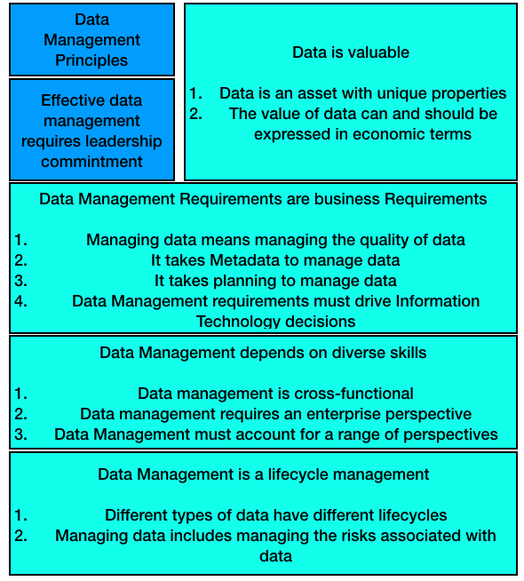

# CSCI 560 Spring 2020
# Chapter 1: Data Management
## 1 Introduction
### Data is a vital enterprise asset.
+ Data and information can 
  - give organizations insight about their customers, products, and services.
  - help organizations innovate and reach strategic goals.
+ Few organiztions take advantage of their data.
+ **Data management** helps organizations derive value from data.
+ Data and information are vital assets both in order to derive future value and day-to-day operations.

### Some Concepts
#### Data Management
+ is the development, execution, and supervision of plans, polices, programs, and practices that deliver, control, protect, and enhance the value of data and information assets throughout their lifecycles.

#### Data Management Professional
+ A **Data Management Professional** is any person who works in any facet of data management to meet strategic organizational goals
+ roles of Data Management Professional
  - highly technical
    + database administrators
    + network administrators
    + programmers
  - strategic business
    + data stewards
    + data strategists
    + chief data officer
+ Data management activities
  - technical
  - non-technical(business)
  - Both must be able to collaborate.

## 2. Essential Cocepts
### 2.1 Data
#### Definition
+ Long-standing definitions of **data** emphasize its role in representing facts about the world.
+ In relation to infromation technology, **data** is also understood as infromation that has been stored in digital form.
#### Characteristics
+ Digitization
+ More and more electronic versions of things have been considered as data.
  - videos
  - pictures
  - sound recording
  - documents
  - etc.
+ Volume and velocity
+ Reliable and extensible data management practices are required.
#### Metadata
+ Data is a means of representation, it stands for things other than itself.
+ We need context for data to be meaningful. If we know the  **conventions** of such a system, then we can interpret the data within it.
  - The conventions are often documented in a specific kind of data: Metadata.
#### Multiplicity
+ Multiple choices to represent data
+ Need for Data Architecture, modeling, governace, stwardship, metadata, data quality management...
### 2.2 Data and Information
+ Data: raw material of information
+ Information: data in context
+ Pyramid of Data, information, knowledge, and wisdom

+ Challenges here
  - It is based on the assumption that data simply exists, but data has to be created.
  - It takes knowledge to create data in the first place.
  - Data and infromation are not separate things, they are dependend on each other. 
    + Data is a form of information
    + Information is a form of data
    + Two terms will be used interchangeably

### 2.3 Data as Organization Asset
+ An **asset**
  - is an economic resource, that can be owned or controlled, and tat holds or produces value.
  - can be converted to money.
+ Monetization of data is becomming increasingly common.
+ Organizations rely on data assets to make more effective decisions and to operate more efficiently.
  - **data-driven** 
    + efficient management
    + professional discipline
    + a partnership of business and technical expertise
+ Data management is not an option, it is the norm.

### 2.4 Data Management Principles

#### Data management characteristics
+ What data an organization has
+ What might be accomplised with the data
+ How best to use data assets to reach organizational goals.
#### Principles needed to balance strategic and operational needs

+ Data is an asset with unique properties
  - e.g. Data is not cosumed when it is used
+ The value of data can be and should be expressed in economic terms.
  - There are techniques for measuring data's qualitative and quantitative value
  - There are not standards
  - Organizations should develop consistant ways to quantify that value in order to make better choices.
  - The should also measure both the costs of low quality data and the benefits of high quality data
+ Managing data means managing the quality of data
  - Ensuring that data is fit for purpose is a primary goal of data management.
  - To manage quality, organizations must ensure they understand stakeholders' requirements for quality and measure data against these requirements.
+ It takes Metadata to manage data.
  - Metadata is the definition and knowledge needed to use data.
  - Metadata originates from data management activities.
+ It takes planning to manage data
  - from an architectural and process perspective
+ Data management is cross-functional; it requires a range of skills and expertise.
  - technical skills
  - non-technical skills
  - ability to collaborate
+ Data management requires an enterprise perspective
  - Data management and data governace are intertwined
+ Data management must account for a range of perspectives. (constantly envolve to keep up with)
  - the way data is created
  - the way data is used
  - the data consumers
+ Data management is lifecycle management
  - Data has a lifecycle
  - Data lifecycle is complex
+ Different types of data have different lifecycle charateristics
+ Managing data includes managing the risks associated with data
  - Data can be lost, stolen, or misused.
  - The ethical implications of data use.
  - Data-related risks must be managed as part of the data lifecycle.
+ Data management requirements must drive Information Technology decisions.
  - Data management and information technology are deeply intertwined.
  - Technologies need to serve, not drive, the strategic data needs.
+ Effective data management requires leadership commitment.

### 2.5 Data Management Challenges
Distinct characteristics +  principles => Challenges
#### 2.5.1 Data differs from other assets
+ Differences:
  - Data is not tangible.
  - Data is durable.(it does not wear out, though the value might change.)
  - Data is easy to copy and transport, but not easy to reproduce if it is lost or destroyed.
  - Data can be used for multiple purposes.
  - Data can be used by multiple people at the same time.
  - The use of data beget more data.
+ Challenges:
  - Not easy to put a monetary vaue on data
  - issues that affect data management
+ Benefits
  - Data, indeed, has value.
  - Data is a meta-asset that describe other assets.
  - Data and information are essential to conducting business between and within organizations.
#### 2.5.2 Data valuation
+ Value = Benefit - Cost
+ For data, neither benefit or cost are standardized.
+ General cost and benefit categories
  - Cost of obtaining and storing data
  - Cost of replacing data if it were lost
  - Impact ot organization if data were missing
  - Cost of risk mitigation and potential cost of risks associated with data
  - Cost of improving data
  - Benefits of higher quality data
  - What competitors would pay for data
  - What the data could be sold for
  - Expected revenue from innovative uses of data
+ Chanlleges
  - primary challenge: the value of data is contextual and often temporal
  - Within an organization, certain types of data are likely to be consistently valueable over time.
  - Establishing ways to associate value with data is critical
  - Putting value on data becomes the basis of putting value on data management activities.
#### 2.5.3 Data quality
+ Ensuring that data is of high quality is central to data management.
+ Poor quality data will have negative impact on the decisions of organizations.
  - Organizations spend between 10-30% revenue handling data quality issues.
  - the esitmated cost of poor data in US in 2016 was $3.1 Trillion.
+ Costs come from
  - Scrap and rework
  - work-arounds and hidden correction processes
  - Organizational inefficiencies or low productivity
  - Organizational conflict
  - Low job satisfaction
  - Opportunity costs, including inability to innovate
  - Compliance cost or fines
  - Reputational costs
+ Benifits of high quality data
  - Improve customer experience
  - Higher productivity
  - Reduced risk
  - Ability to act on opportunities
  - Increase revenue
  - Competitive advantage gained from insights on customers, products, and oppotunities.
#### 2.5.4 Planning for Better Data
+ Deriving value from data starts from planning for better data.
+ Decisions about data involve:
  - The way data connects business processes that might otherwise be seen as separate
  - The relationship between business processes and the technology taht support them
  - The design and architecture of system and the data they produce and store
  - The way data might be used to advance organizational strategy
+ Planning for Better Data depends on
  - a strategic approach to architecture, modeling, and other design functions.
  - strategic collaboration between business and IT leadership.
  - the ability to execute effectively on individual projects
+ Challenge
  - organizational pressures and the prennial pressures of time and money
+ Solution
  - Having clarity about the trade-off between long- and short-term goals
#### 2.5.5 Metadata and Data Management
+ Metadata describes
  - what data an organization has
  - what data represents
  - how it is classified
  - where it came from
  - how it moves within the organization
  - how it envoles through use
  - who can and cannot use it
  - whether it is of high quality
+ Challenge:
  - Metadata is a form of data and needs to be managed
  - Metadata often provides a starting points for improvements in data manamgement overall.
#### 2.5.6 Data management is cross-functional
+ range of skills for data management
  - design skills to plan for systems
  - highly technical skills to adiminister hardware and build software
  - data analysis skills to understand issues and problems
  - analytic skills to interpret data
  - language skills to bring consensus to definitions and models
  - strategic thinking to see opportunities to server customers and meet goals
+ challenge
  - getting people with this range of skills and perspectives to recognize how the piece fit together so that they collaborate well as they work toward common goals.
#### 2.5.7 Establishing an enterprise perspective
+ Managing data requires understanding the scope and range of data within an organization.
+ Data is not unique to an organization
+ Data originates in multiple places within an organization
+ Challenge
  - Differences in representational choices
+ Solution
  - data governance
#### 2.5.8 Accouting for other perspectives
+ Different legal and compliance requirements across national and industry lines
+ Knowledge of the potential use of data
+ Risks of the misuse of data
### 2.5.9 The Data Lifycycle

+ Challenges
  - As data is used or enhanced, new data is often created. Data is rarely static.
  - lineage/data chain: a pathway along which it moves from its point of origin to its point of usage.
    + Lineage requires documenting the orginal data sets and theire movement and transformation through system.
+ Implications
  - Creation and usage are the most critical points in the data lifycycle.
  - Data Quality must be managed throughout the data lifecycle.
  - Metadata Quality must be managed throughout the data lifecycle.
  - Data Security must be managed throughout the data lifecycle.
  - Data management efforts should focus on the most critical data
#### 2.5.10 Different Types of Data
+ Data can be classified by 
  - type:
    + transactional data
    + Reference data
    + master data
    + metadata
    + alternatively category data
    + ...
  - content 
    + data domain
    + subject area
  - format
  - level of protection
  - how and where it is stored or accessed
+ Chanllenge: different types of data => different
  - requirements
  - risks
  - roles within the organization
+ Solution: Many of the tools of data management focus on aspects of classification and control.
#### 2.5.11 Data and Risks
+ Low quality data is risky because  its information is not correct.
+ High quality data is risky because it can be misunderstood and misused.
  -  e.g.: the information gap: The difference between what we know and what we need to know to make an effective desicion
+ focus by regulators and legislators on the potential uses and abuses of information.
+ Comstomers become more aware of how their data is used.
#### 2.5.12 Data management and technology
+ Data management is strongly infuenced by technology.
+ data requirments aligned with business stratey should drive decisions about technology. (prevent technological temptation from driving their decisions about data)
#### 2.5.13 Effective data management requires leadership and commitment
+ Organizations are far from being data-driven, even they recognize their data as an asset.
+ They do not know data management
+ They underestimate data management
+ Changllenge:
  - to become better at data management requires vision, planning, and willingness to change.
+ **Chief Data Office (CDO))
  - leads inititives of data management
  - leads cultural change within an organization
### 2.6 Data Management Strategy
+ Strategy:
  - is a set of choices and decisions that together chart a high-level course of actions to achieve high-level goals.
+ A data strategy should includes business plans to use information to competitive advantage and support enterprise goals.

## 3. Data Management Frameworks
+ Why frameworks are needed?
  - Data management involves a set of interdependent functions, each with its own goals, activities, and responsibilities.
  - Data management professionals' tasks are also very complicated.
  - Frameworks developed at different levels of abstractions provide a range of perspective on how to approach data management.
### 3.1 Strategic Alignment Model (SAM)
+ abstracts the fundamental drivers for any approach to data management.
+ center: the relationship between data and information.
+ Information is most often associated with business strategy and the operational use of data
+ Data is associated with information technology and processes which support physical management of systems that make data accessible for use.
+ 4 fundamental domains of strategic choice:
  - business strategy
  - information technology strategy
  - organizational infrastructure and processes
  - information technology infrastracture and prcocesses
  

+ **Note:** the fully articulated strategic alignment model complex than is illustrated in figure above.

### 3.2 The Amsterdam Information Model (AIM)
+ takes a strategic perspective on business and IT alignment(Known as 9-cell)
+ a middle layer that focuses on structure and tactics, including planning and architecture
+ the necessity of information communication(the Information Governace and Data Quality pillar in figure below)
+ **Note:** Both SAM and AIM describe in detail the relation between the components, from a horizontal (Business/IT) and vertical (Business strategy/Business Operations) perspective.  

### 3.3 The DAMA-DMBOK Framework
+ DAMA Wheel

+ Enviromental Factors hexagon

![figure5](data:image/jpeg;base64,/9j/4AAQSkZJRgABAQAAAQABAAD/2wCEAAkGBxAQEBUQEBIWFhUVFRUVFRUXFRYWFxUQFRUYGRcVGRYYHSggGBomHhYVIjIhJSkrMDIvGiszODUtNystMCsBCgoKDg0OGxAQGy0lICUtLy0vLS0tLSstLS0vLS0tLS8tLS0tLS0tLi8tLS0vLS0rLS0vLS8rLTctLy0tKy0tK//AABEIANQA7gMBIgACEQEDEQH/xAAcAAACAwEBAQEAAAAAAAAAAAAABQMEBgIBBwj/xABFEAACAQMCAwQFBwoFBQADAAABAgMABBESIQUTMQYiQVEUIzJhkxVSU2LR0tMWFzNCVFVxcpGUJEOBgpJzdIOh1Adj8P/EABoBAAIDAQEAAAAAAAAAAAAAAAADAQIFBAb/xAAyEQACAQIDBAgGAgMAAAAAAAAAAQIDEQQSMSFBUfATUmFxobHR4QUUIoGRwTLxFUJD/9oADAMBAAIRAxEAPwD7jRRRQAUUUUAFFFFAFXiXEYbaMyzuEQFRqOT3nYKowNySSBUlrcxyoskTq6MAVdSGVlPQhhsRWfD+mXhfrDZsyJ5PfEFZH94jUlB9Z3B3UVDxmyS0SW9t5DbuAXcKuuKd+gD24I1uxIAZCrk4Go9K5J4uEanRstl2XKnZ3s3ZS20csttE7vqZmZAWZi7ZJJ6mmX5JcO/Y4Phr9lI+xd/fvbmDlW6S27tFNG7yalfOpTspBVlZWBBxg+40/wBXEfmWvxJfuVmVXPO/q8S6OPyS4d+xwfDX7KPyS4d+xwfDX7K71cR+Za/El+5Rr4j8y1+JL9yqZqnX8QOPyS4d+xwfDX7KyHEDaRyXKrwu3ZIJY4dZUga5PRtOTo07+kHugk9zyNbLXxH5lr8SX7lRvHfEEGK0IY5YFpCCdtyNG/Qf0q9Oo4v6pX+4WMrPHZRthuH2ndNsHXYSE3MzRqUQruq4BJzvhgPZ367ORWVyYebwy3iWeIyo2nqAkLYAdFJ3lIz0OMj3aVba8GnEFmNOQuDINIPXHq9s17JBeMAGhsyF9kFpDp/h6vboKu6uy1/ELCnszwiyu4uY9hboCFKgIDsc9SQPIU5/JLh37HB8NfsrmGG9TOiGzXPXS0gz/HEe9S6+I/MtfiS/cpc5ycrqVvuFjj8kuHfscHw1+yj8kuHfscHw1+yu9XEfmWvxJfuUauI/MtfiS/cquap1/EDj8kuHfscHw1+yq0fB7a2vrU28KRlhOGKKF1KIwcHHUZq5q4j8y1+JL9ystx/jV4t9DH6lOSpe4mQPKLeK4IiRmVtIyTqPUhQpYggbvw0p9Im5XXeQ9Dd8Y41bWia7iUIDnA3LNgZOlFBZsAEnAOAM1fRgQCDkHcEdCD45pJw7g0UJMneklcYkmlOuVx5FsYVevcUBRnYCoOzT+jyPw9vZReZanztCcGMe+JiE/laPqSa76OLjVm4r+yrjY0dFFFdZUKKKKACiiigAooooAKKKKACk/aXiLxRrHB+nnblQ5GQrEEtKw+aihnPngL1YU4JrMcEPpUr8Qb2WBitR5WoOTKPfKwDfyLH0OaRiKypQciUrjPhtilvEkMedKKAMnJPmzHxYnJJ8SSaVSf4u80f5NowZvKS9K5RfeI1YMfDU6+KGrnH+INBF6oBppGEUCHo075xn6qgM7fVQ1Lwjh620KwqS2MlnONUkrEtJI2P1mYsx95rCvZOb1fLY0Rdph6FcpxRP0eFgvQM72xb1c+POJm3PzGbyFakMCMioriNZFZHUMrKVZTuGVhggjxBBrNdkp2t3k4XMxLW4D27Md5bBjiM+9oz6s/wU+NQ3nh2ry9udCbbTVaq5LVwWrktSHItlJNVeaqj1V5qqMxNiXVRqqLVRqozBYm1UaqhDV6GozBYnDV6DUAaug1TmIsVuOcVjtLeS5kyVjXOke07HZY1HizMQoHmaXdmOCslu5uwrT3ZaS6B3Us66eTv+oiYQD3E+NUZj6fxAR9bewZXfyk4iVyie8RKwb+Zh82tYDXQ3kjl3va/16/gpYTdnJmjL2UpJe306GY5Mto2eVISdyw0sjE7loyf1hU/aCzkdFlgA58Dc2EE4DkAh4SfmupZfcSG6qKg7RwOoS8hUtLb6joHtS2zY50I95ChlHz418CabWtwkqLJGwZHVWVhuGRhkMD5EEVbO4tVI8v3DsJuGX8dxCk8ZJV1DDIwRnqrDwYHIIPQjFWqzVk3od4YekN2zPH4BL0AtLGPdIoMgHzlkJ9oVpa3qVRVIqSFNWCiiimEBRRRQAUUUUAFFFV+IXkcETzStpSNWd28lUZP8aAEvaubnFbBWI5oL3DA45dip7/e8DIfVjocF2HsV5wbiTySPE8DxqO9A2juPAFQe0hZVYMSACRkYIHXGa4tJIsUhlRBcXSG6kEsoQRwW7IUt1BBWXQpGpMqrFnJZdeati1kijFrHJ66+dpXZFaMQW+lBNIqM7MrYKqDqPrJQegwMnEyVTu3ftjI7Bnws+lXD3h/Rx6obbrgjOJp/9zLoU/NTIOHNOiait4UjRY41CoiqqqNgqKMKoHkABXRNZdSd32DVE9JrPdrbKQrHd2wzcWrGRFG3NiIxNbn3OvT6yqaeFq5LVSNTLK5bKQ8N4hHcwpPC2qORQ6H6rDO48D4EedSTS6VLYzgE4HU4HQVmOHn0G+a1O1vdl5rfriO69qeDPQBv0ij+cVpS1FVKMtmj2ruJSuIhxmWNYnZkm58YdVXuAMzxKCrb5j9aBk5PTzwOz2iIODEO9zQnrCSXimSFlKqhYd5yRgMSB0B2Fq7EFvHLOYkAAMkhCIC2jvamO2SDvknbrVARW3LN20RfmgDQwRixkkXSozs2pxHgsSAMYIFMUoSV3Hs9gs+J6e0pMZkEWF0bnXuJNEjYCFRkZjIycdRt1AsPxpwW9UpAZUVhI5DynJKaViLalUZOkNjp4Nj1bmBVYTRrCFDsVcJgxxqC8gK5BUCTc+GTVa0msZJHiEMYck5BiTvtzZl64wxzbyN/765wfQ9uR2Cz4kdt2oZ8ScsBH5fLGrvEyRRMA+V7uGkxkZ23xtVxePnWUMXsPEkhEmdLSztCuju98agCc6dj5jFcre2JyRyj3VU4QHKNHrVNl3HLbVjwU56UwhgiCgIiacLjSq4wp1LjAxgE5HvOaicoL/RoMr4l0NSrtPxdraDMQ1TyMsNunzriTZc/VXdm9ymmAas3wU+nXj3x3hg1wWniGbOJ7gfxI5YPkp86pSt/KWi5SCS3Dzs9wtbO3SBWLEZZ3PtSTOS0kh97MSf/AF4U0DVADXQaoc3J3ZGUnDUl4UfRbhrQ/opNU1sd+6c5ng92lmDqPmuQBhKbA1R45YNPFiMhZY2EsDkZCTpnTn6pBZGA6q5HjTqclo9GUkizxjh4uYWiLFTsyOMExzIQ0ci58VYKf9Kl7PcTNzDqcBZUYxToP1LhPaAzuVOQynxVlPjWY41xOaeyW5gnECjKyRHKyekB+W0POVZCrK4I0rGxYjAODXfD+LKskd8uRHLy7e8GNOmUgej3OnJ0qdag+OiVCcaDWpgpOn9MtH4MVLabeiiitQoFFFFABRRRQAVku018JJXTSzwWS+k3CqMmS4ReZBbgeJGBKRtvy/AmnnHuJejQNIF1uSEijzjmTudMaZ8ASRk+ABPQVguLxSYSwik5kgzNdMgVma5dgS8gZGe2XWyGORA5ABGnCahz4ipZZVv8t5KGVjcyzO7XUsPIh03L4KTosbK7JouNCd0adRDJqAA7xDbMuARM+u9lUrJcadKkYMVqueTGR4N3mdh4NIR0AqkbFS0fDUJaOMLPduwXVJ3sxRMyKoZnZdTHG6x4I79aNjWJiKiSst/l76/gdBAxqMmgmuGNcLY5IC1clq5Jrkmltl0hd2i4WLu3aINocEPDJ4xXCHVHIP4Hr5gkeNcdnuLm6gDuuiVCY54/o7hNnX+HQjzDA0wLVmeKn0K7W8G0NwUhuvJJfZguP6kRsfIqfCm03nj0e/Vftffz7yGrbTQX9sJk0MSO8jAjGQ8bh1OCCDhlGxFUrXg0ccBt1Z9JbWDlQyOGDArhQBhlBAxgdMaQAL5avC1IVaSVk+0ZlQsvOBLMrLJNKS6yxs2UyYplVXQLo0qMIvsgHO+dzUg4KgfWsjq2rUCNBw3MmfPeU/tEq/wI8Rmr+qjVVvmZ2tcjIhWOzkHLWPLHSVILCNyCtukHR0K7qinp1391OIECKqKMBQFA8lAwBUYavJZ1RS7kBVBZidgFAySfdiodWU9jYZUhV2rvJCqWUDETXRKBh1itwPXTbdCFOAfnMKdWNskMaQxLpSNQiKPBVGAKz3ZWNpmk4jKCGuAFhU9Y7JT6se4vvIf5gPCtGGp1WWVKmt2vf7aFEr7ScNXYNQA12DS0waJwakBqBTXYNMTKNCa7jFvcnJKwXvqnKnSY7wroSQEezzFATPz0TG7GlFikVq7Wk6cuCRZxLFy4Rb8ssERkWEF1TQMGSQgb946sAaviFmlxE8MmdLqVODgjyZT4MDgg+BANZq5580D40+krizu9aF4mhIbTOYQRrQiUP7QCiRs6tBU6NCpmVnzwfPYJkrGl7MXbgPaTsWmt8KWPtS27Z5M58yQCrH58beGKeVgIL9tK3KuZZ7MHnYU5msZMM691QkrpgMDHkFo8DTrIreQTK6h0IZWAZWByCpGQQfEEVs0KmeO3VaimjuiiinEBRRSXtPfOqLbwNie4JjjYbmJAMyz/AOxdxnYsVX9aobSV2Ah4txqLnG8lYC3t5DbwEkBTcsdFxcajthAHjXxJEijJZag4c5gi9JuFRzbIYY9JZ5Zbp2AYBpFykjsyoUDuNZwT3c02m7NIOXyJDHyoeRGhVZIuSca0eNhlw2lMnUD3BuO9mvaW0ctwqRIEtrIlI0UaUa8IwxAG2mJWKjw1u3ilY1WvGd5c24c8WNS3F3gdg0ER5pDTSMZZ2HRpmxkD6igKi/VQVdY10xqMmsucnJ3Y9I5Y1GTVfiN6IULlWYDrpAJA8zkiuRfR50swV9OoxsyhwvmVz099Kadrl0TMa4JqmeKwdeamnSW16l0YDafbzjOTirGsEZByDuD5jzpc01qhiPS1Vr63SaN4ZBqR1KsPNWGDUpNcE0rM07ovYS9mLxwHs52JmtiFLH/Ntz+hm95KjDfWU071Uph4N6dfa45Hh9GjaOSaLllmkl0uIPWKykKoDnK7a1x406/I1/3jd/8AGy/+atVfDKtdKrGyvts7+mj1EdPGDyvcRaqNVS/ka/7xu/8AjZf/ADUfka/7xu/+Nl/81H+Fr9aPj6B81DgyMNWe7QN6VNHw5fYIE12Rna2U9yLPnIwxj5qtWl/I1/3jd/8AGy/+aktnwz0G7nhdmkaci4SZ9OuVFVY2RtIAzGdOwAGmRds5qJfD6uGi6smnbS19eOm7UFWjUeVDpTXYNQA12DWWmOaJ1NSKaXrfx84wZ74TmHbbTnB73TIyCR4BgfGuRxi3yAJUYkBhhlI069GrOcYBO9OjCXAo7DUGpFNLbnicMRAkkUZKjOR7TuiqD5ZMif1qaLiMJx6xASnM0llDCPGdRGenv6UxRla9ijsMFNJuOgQSLfY7gXlXY2w1oScSHz5TMW/keTqcUzt51dQyMGU9GUgg422I99TkAggjIIwQehB6g06nNwkLkrmb4dwq5hu9MAKwKSxdmEnOj0wKis7lpGYYnx7IGlSdWclr2ePoszWB2jw01p5CHV6yAf8ATZhgbAI6geyaj7OOYS1g5J5IDQMSSXs2OE3PVozmM9TgKx9qrfHrF5Yw0OBPCwlgJ2HNUEaCcbK6lkb3OfHFaVLEOFVX0fNxDWwe0VT4RxFLmFJ0yAw3U+0jqSrxsPBlYMpHmDVytoWcu4UEkgADJJ2AA6kms3wHNw78QcEc0BIFOxSyU5Q48GkPrD0OCinda77SP6TInD19lxzbo+VoCQIj75WBX+RZOhxTgVmY+vZdGvuXit4q7Q8QeKMJDjnzNyoARkCQgkyMPFUUM58wuOpFd8NsUtoUhjzpQYyTlmYnLOx8WZiWJ8SSaocGPpUzX59ggxWv/bagXmH/AFWUEfURDtk04asqq8qyfnv9hsVvOGNRtXbVExrlY5Fa+g5sbRk41DGfKlPEOBiZnzIQruZCoUEiUwcjIY7adO+nG58cEinbVEaqqsofxZfKmI5+BlmaRpPWOdRIUquruAFQrhl2Qbhwc753xTG3i0Iqai2lVXUcZbAxk48TU7VExpVStKSs2XjFLQ8Y1R4ldtGg0LqkdhHCnz5n2UHHRepJ8FUnwq2a67J2npE7XjD1cReG38mfOJ5/6jlqfJXPR6dgML8xWUXotr57QrTyRuaDgHChaW6Qg6iMs7nrJM5LSSHyJYk48Og2FMaKK9mlYywooooAKSdq+EtcQAxY58Lc2Ak4BkAIMZPgrqWQ+WrPUCndFRKKkrME7GFsLxZo1lTOGHQjDKRsyMPBlIII8CCKtqar8ZtPRLzUB6m7Yn3R3oXLD3CRVLfzI3i4qVTXisZhnh6zhu3dxqU5543Fl12ejl1lncNI0hdgzYKSRmIroJ0jEekZx1QGrLcJZ3DySgnUjMBGFBKSI6gd44Hcwcljv1AAFXlNSqaI4ipxIcEKoOzyqF0yNqQ5DFQc4lgdAemQq28cfmQM9a5g7LIo08wldIGGBYcwW4t9WktoxoHTTnJPextTtalWnRxNXiLcER8MtTFGELlzljqOo+0xOO8zNgZ8WJ99XlNQrUq0Zru7KtC7j9o5VLmBcz25Loo6yRkYlg/3qNs7BlQ+FNrG8jniSaJtSSKrq3mrDI/h/CvFpPw8+iXTW52huC8sHktxu08P+7eUf+ToAK6YPNG29c+/5FSW0mhY2l7g/oLs/wCkd8F/9LKi+4a4/EyVpaU8WsEuYXhfIDDZh7SOCGSRT4MrBWB8wK97OcSeeIibAnhblTqNgJlAOoDwR1Kuv1XGd81s4Gvnhleq8hMkJLC79DllF8pjeeZn9IJ1QSAnTDGJP8oqgjUI4XJyQWJJqz2jkaUpYxkgzgmZhkGOzUgSEEdGfIjXx7xYewamu+Oc/VDZxLP1R5X2tk8GUtjMzde6gIyMMy1kIeyPo14Fa8uY1uUVUMDrDGs8OtvR1jIbRHoZ2RATjS+5yKRiKdJVHLNt1trz3EpuxvlQKAqgAAAADYAAYAA8BXDVnz2RP7x4h/cL+HXDdkz+8OIf3C/h1mSjDreA5N8B+1RNSFuyh/eHEP7hfuVGeyp/eF//AHC/cpUoU+t4MYm+A+aojSNuyx/b7/8AuF+5Ubdlz+3339wPuUpwp9bwYxN8B21RsaSHswf26+/uB9yo27Mn9uvvjj7lKdOn1/Bl05cC9xDmSMlrCSJJyRqHWKBcc6b+KqQB9d1HQ1urK1SGNIYlCpGqoijoqKMAD/QVg+zUQsLwcySSVLlVhEkz63imUs0aA4ACPqYfzBRvqGPodel+FUqcKF4O99WcWIk3OzCsXNe3Eba0SaScNca49coXCiQxKIdBjMRATDgqxONySwOg4/xB4EjKYy8qx5KPJgFWOdEfeb2fDzpbb9p2JCSQyK4MZZtOE5c1xJDE2l2V1LiJmxpOkHfwzpCCtd9oLlAdA5mC5VxA4WUIkLad2yDmR12DZ0HpparXDuJXAnSFwSjNKM6GLABpiGZiQAmFQBgGG4BxkGrNt2kSQLpgm1MocR4i1mIorczaTGO8oxnVk9Kil7SgJIRE50axrwojDjmaFPf1blMZA8R08ACpYcQn+UnV1l5chkRFw5SLlADVJtpXXoLoV6iRtRyFA1lZ4drIcP3JG0ZBKhSpZJFik31dwKzbl9IwpIyBmndlcrLGkq9HUMN1OzDPVSQf9CR76AK3HOGJdQPA5IDDZhjUkikMki5/WVgrD3ishwy4d1KygLNEximUdBKuMkfVYFXX6rCt9XzPiFsOIXMt2k00MZ0xRmB9HOSIsDM+VOcszBT81QfEYyfi9KnKkpTdmns9Dow0pKVkPVqVazi9mT+3X3xx9yu17MH9vvv7gfcrz6p0+v4M7G3wNItSrWaHZc/t9/8A3A+5Ui9lj+33/wDcL9ymKFPreDFtvgaValWsyvZU/vC//uF+5XY7KH94cQ/uF+5TVCHW8GLbfA1C1U4xw/0iEoraJAQ8UmM8udDlHx4gHqPEEjoaTL2SP7x4h/cL+HXX5JePyjxD+5X8OnQUU7qXgLdxrYccja19InKw6MrOHYARTIdLoWONg3Q+III6iqVl6TPdG7tY+VG0XLZpwyc8qwaJ1hxrUKDKNTaSdfskYIz/AGb7OS6m4lDIZy8muBLs6w8SoqJOJFHqpXC5EmlvVlVIrZ2HaSF2McwNvMBkxTaVJAIBZHzolTcd5ScZAODtWthaVKM209vDh6ipNlSzX0S6a1P6KcvNbnwV85ng9255ijPRmA2SrvGeHC5haIsVJwyOOscyENHIM+KsAceOMHape0HDDcw6UYLKjLJBId9E6boxxuVO6sPFWYeNRcG4gLiFZdJRt1eM+1HMhKyRn3qwIz0OMjY0jHUnCfSR3+ZMXuK/BeIG4i1OoWVGMcyDPcnTZgM7lTsynxVlPjVxqUcV/wALcrdD9FMUhuPJXJ0wT+7c8tj5MpOyU4as6rHbdaMbFkLVG1StSt+MQiR4zqGiRYmfSdAldEdVLe8SJv072K58regxOxaaozXCX0LEBZYySCQA6kkAkEgA7gEH+lVxxOAsEWRGJAYBWDZUvozsemralOEuAxNEzCo2Fc+mwkAiVCC2kEOu7/NG+7e6vEmR8hGVtJw2CDpbyOOh91KlB8BiZWv7RZo2ifOGGMg4ZT1DKfBgQCD4EA1oOynFmuICJcc+FuVOAMAyAAiQDwV1KuPLVjqDWesL6O4TmRklc+Ix1UMP6qyn/XfByKje69DuFvP8vAiuv+3ySsx/6TMSfqO/UgVpfC8Q6FXop7E/B+/oKxEFOOZbjeSwK5UsM6W1L7mwRn+hP9ahm4fC7F2QFjywT4kRMzx/8WdiP41ZFe16kzyhLwa3YaTGMYC4yR3AunQcHddOxU7Edc1CvZ+35jyFM6xjSSdI2cE6emTzH3PTUcYzTWigCg3BrcknR132Zhg6gxK4PcYsqklcEkZO9W7eBY1CIMKowAPAVJUN3cpFG0sjBURS7sdgqKMkk+QANACDtpftoWziYiS41BmU4MVquObICNwx1BFPUM4P6ppdBEqKEQBVUBVAGAFAwAB4DFVLBnmd7yVSsk+CEPWK2XPJiPkQGLMPnO3himCivI/E8V09bLH+MdnqzSoU8kbvVnS1KtcKKlUVwxLs7WpFrhRUgpqKMkUVItcLUi02Itki0n46fSHXh6n9Kuu4I/VswcFc+Blb1Y6d3WRutMb28SCJ5pDhI1LMcEnAGdgNyfAAdTtVfs5ZSIjTzjE9wwklGc8sYxHCD5IuBtsW1N+tXVSWX6/x38/oTLgNlUAYA9wHupJwy3W9mkupFDwpqgt1YZVsMOdPg7HU6BVPzY8g4eu+0MzvosoWKy3GoFx1itVxzph5EBlRT8+RT0Bp/a26RIscahURVRFGwVFGFUDyAArUwFD/AKP7CpPcS1m75fRLwTDaG6ZY5fJLzAWGT/yACMn5yxgdTWkqtxKxS4ieGQEpIpVsHBwfEEbhh1BHQjNaFWmqkXFlU7EF3bJNG0UihkdSjqejIwwQf9DSbgE7gPazMWltyFLHGZYGzyZ/4sAVb66N4Yqfgl+/KeO5I51sSkxAwHAGpZlHzXTDYGcHK7lTSG446k8hureOUPaA8xWXS81k7ESjle2rKY9aq6qx04Aw+awuhl9UGtPP3Gp7zVMKSLwaDmTyHSzzSawSATGRBHDhf9Iyc/WNOkdXUOpBVgCpByCpGQQfEEVnL3hMguLmeCJFZreBY3Cx6jMslyZcZIw2mRNyQCSN9jjlhq1e39oaR3vZoSEAzEIF0hQuMf4d4DjvacYctupOds42qS44M0h1SSjvY1aI9HsurLp7xI2UjfUd+oAxUDW14VKuJGypCYaNNJLvqEoMj6gUKAbsdjnSd6jNheKjIjSYWJuX6xc87kRhFznpzBJsdv8ASrty668CVbgdTdny+ktKMhTGdKFFMR5YIwrjLerG7Fh9XYYltuEFBMOa2JRpGnK8sd/vLlmw3f8A1cLtkKMnNJku4z3g4DXBCFWj0LHJdynvqDk6o2i3wceODqzzcJxBlGBImFAO8TNzRGO/tKo06tXUnJx3SKrJTatnVvsXTS3Fzg/CfRtffBVyCEVSkcZ31aE1HSGJ1H6xJ8gL0kYIIIyCMEHoQeoNVOGxXAll5uoqSSpJUD2zgKoY7Bcb4XbGQTk0wIrgr3c7t3fFDoaE3Yq8KhrGQktAAYmOSZLM7Rkk9WQgxnqe6rH2q1FfKuWb29ZleRIbUPDrikeJ5Ll9JkUSRsG0IFUEZwW6+zTP5GX6e8/v738WvQQ+LQpwjGqnmttt/epxvDttuOh9Cor558jj6e8/v7z8Wj5HX9ovP7+8/Fq3+aw/CX4XqHys+w+h1j+1l0bidLJf0aaZrk7775hg/wBzAuw8kAOz0t+Rl+nvP7+9/FpfwkG0vJLV2ZkuMzwSOxd2dVVZYWkYlnYBVYEknTt+rS63xSNWlKNG+a2/hvt9iY0HGSctDQgUm4jxGZJbjQUC29vFPpZSS5dp9S6gw05EKgHB3Pj0p6BUMnDoXcSvFGzjADlFLAAkjDEZGCSf9awaLjF3kjrltWwVtx4kkJGwxIUDMrYIjmEUm5AGc5xgnpvjpU35QKFxy2ZxoDAb4MhjEeQoJwwkzsD7DdSKZrYxai3LTU2Cx0LliDkEnG9SmyiIIMaEMFVgVBBVfZB23AyceVdKlR6viKebiLU44SMiFuqqAxIYytqOkIFLnZGOy5x4dcU27TuYHmVAFZQYCSMhzZLchXTx217g+W3jT/5PhK6OUmnbu6Fx3RhdsY28K6ThduCSIYxldB9Wm8eANHT2cADHkKZGdHqlHm4i8do86tMEh7xCnRJhgrlSdkJ/Vz3Q2xycYOHlnMskaSKQVdVZSCCCrAEEEbEb9RVc8MtzqzDGdZBfKL3yCSC225ySd/Oji176NDlFDOSscMfQPM+0abdF8SfBQT4Va0JWUFtKO61KHEJknuVjdgILZ4mlJxh72Rl9Gh/2lkkI+c0fvrRXEyxo0jsFVFLMxOAqqMlifAAAmsFPEARZ4FwFdOZhp0M08zk3ExlhJXIb/KYDQBnIGkVobqD0iaPh4LNFGqS3TMSxaMH1MDMfaLspZuvdjIPtjPasPmcYLntFN7y52Xt2fXfSqRJcadCsMGK0XPJjIO4Y6mdgdw0hHRRT+iituMVFWQoKKKKsBne0sfo7rxFekY5d0PnWZJPMPviYl/5TIBuRSPjFvOl/HNG0sgbS6IuklgDiREUNGgURjBeYsczLpOVwd6ygjBGQdiPMVh5eHERzcNwDJDG8lizM65hYFUUshBIjYiNhndNBb2q4cVTs+kXc+4tF7iXs3OkbC2T9DInpFnkY/wAOxGuDB3BjZhgbYV1H6pp8wrFQSo+m1gkYywCN7YSCPEN3GsqvbPLCOUA6pJGVjyFAcbHSK13DL5LiFZkyAw9k+0jgkPGw8GVgykeYNZOJpWebnl+dx0JEjCoyKnYVwwrhaHJkBFRlanK1wRS2iyZARSXtPxB4Y1igwbi4blQA+DkZaQ/VRQzH+AHjT58AZOwG5PkKzXZxDdzPxJx3GBitAc7WoPelwehkYZ/lVavSgts5aLxe5c7iZPchjwnhiWsCQR5KouMn2mbqzt5sxJJ95q1pqcrVKHiULvy1LZ1MgzHIqs6agyq7KFYjS2wJ9k+VKcZTblrxL3SJtNGmvTKmoLncqWH8qkAnPTqRUmP/AO91UyMnMR6aWdo+FNcQYjOmaNhLA/zZ03XP1Tup9zGmMV1G0jRq2WXqMMB4dGIw2MjOCcZGasBavHNTknvKtpoXcC4kt1AkygqTlXQ9Y5kJWSM+9WBH/umIFZyQeg34fpBesFfyjvwMI3uEqgL/ADKPOtOFplWmk7x0e1en2KqXE8C12BXoFdqKhIhsFWuwKAKkUUxIo2Cis0/EYmuPSpcmKJnt7ZV7zPLutxcIgOp9OOUNILAByAQ1Me0F0wVLeFtMs5ZQ2RmKFQDNcb/MUjGdtbKD1rNJALuZrS3jMcAhFqxMO8MKAlRokdXic5JSVQ4OxK90Gu/DU1bM+Vz+xM5bi/wMR2kL3msSxxxrbQcuERPcIrBY1Y6yJpC5CK2EGSxAw2a1XZzhrQQ+tIM8rGWdh0MzAZA+ooCouf1UFL7dPS7zV/k2bEL5SXxXDH3iNGx499z4pWlrXwtOyzvV+QqTCiiiusqFFFFABSbtNYu6LPAMz25MkY6cwYxJAT5OuRvsG0t+rTmioaTVmB8/4sC6R3Fo2iKfEglHtxyOCcFT38MwRjGo3ZW1bMTVjhPEVEyyoCILxjs2MxX6ruDpJULKi52ONSdSZKuXFjHFctayrm3u2aWIdAl2vrJYwRggtgzKRvqEhyNqZcQ4TFLbG2xoTSFTRgGIpgxungGQqpHkVFYtdKD6OX57PX0GriTkVwVqpwG+aaIiXAniYxTqNgJlAOpR4I6lXX6rjxzV8is6cHF2Y1MgIrkrU5FUuLX8drBJcTHCRqWY+4eA8ydgB5ml5W3ZF7me7VMbmROGRnHOGu5Yf5diDhh7mkPqx7tR8K0KQhVCqMKoAAAwAo2AHupV2U4bIiPc3Ixc3TCSUdeWuMRW4PlGu38Sx8aq8R4bMbh5ggKie3OQh53KVU1GOTUAFBHeXByurGSQKdKEW+jvZLxfPgiE7bR/prPTdmcglZSGY3WrOtl03DSEMiFsI66gMrjILA9QRFz+I8sltQYFNQEYOHKy60RuWTo1crDBJB9bdisgu7tixTmYDusg5aHlosyL6shfWOE5u3e9np7IaYUZw/jJEuSep5N2bZiW1IMvr5YUiMfoe6B4D1WrOPabODjeew4CYpUcMmEUKcKdwE06RrLFQDg5BGwwQetcQtfk6iXwCoVTHH342kmGtxgENoEDEArgncDcCsRduEMgl7rbyLGusqJbc6ghjUgY5vdKn2TjV3Sb2qNZXJWIuuBdseByRXTXHNGHL8waTmTJJiJJOxjUhBjYjywMO9NZtIbtnVnRvaTfSu6cy37zAbatKuT5EHGMVFEL+OJAvMyIwGYopkM6xqFVu4dSltfe2Gw7wByaToudm5K4KaW4fcY4Wl1BJbyZCuuNQ9pG6q6+TKwDA+Yqr2V4i88TRz4FxbvybgDxkUAiQfVdSrj+OPCpuEvcGaVZtRUE6SVCqO+2lQNO/d094O2cbhD3aodol9DuE4kv6MhYLwD6At6ufH/62bc/Nc+VRGnrTfeu/wB/OwOW80oFdAV0oroLSVELngWunYKCzEAAEknYADcknyroLSLtC3PcWQBZAvOugoyTbAnRAB5yspGPFEcbZFOp08zsUlIU+nMzC4dxC14G5TyFVENjDho49MilWklyzlDoOksNQMYNT8Jj9EsIBAP8RcqkcAbXgMyatfKc+pVUBleJcAFSBuck4RZXM1w0kpaMko1xA6eydsCKVcxzRtyoxk5ZVDeyXIDns6vpUzcQb2MGK0/7fUC8w/6rKCPqIh8TWrSp55ZNy2v9LnvFNjjhHDktoEgjzpQYyd2ZiSWdj4szFmJ8SSauUUVqiwooooAKKKKACiiigBfx3hvpMDRatDZDxyDrHMhDRuPPDAZHiMg7E1V4JxA3EQZl0SKTHNH15c6HDrk9RncHxUg+NOqzfFI/RLpbobRXBSG48lm9mCc/xyImPU5j8ErjxlDpIXWqLRdiLjI9FnW+H6NgsN0PARlvVT/+NmIJ+ZIxPsinhWvJ4VdWR1DKwKspGQysMEEeIIpP2cmaMvYykl7fToZiSZbRs8p8nqw0tGx66kz+sKxms8e1eQxDYrWUvR6ffi3G9vZMss/lJekZhh8iEB5jDzKU47U8XNrb6o11zSMsNvH8+4k2UH6o3Zj4Kprrs7wZbO3WENqbJeWQ9ZbhzqkkPvLE/wABgeFRFZI5t+i/b5/RN77C6VrkrU5WvCtc+Uvcg015pqbTRpqMpNyHTRpqbTRpqMpNyLTXoWpNNe6anKRcjC1xcWySI0cihkdSrKRkMjDBBHkQTVjTXoWrJENmY7ITNCZOGTMTJa6TExO8ti+eS/vK4aM+9M+NacLWd7YWkiCPiFupaa0JYoOs1o2OfDjxJUal+sg86f2V1HNGk0TBkkUOjDoUYZB/pT6kVL61v17yl9xFxO+S2heaTOlBnAGWY9FRR4sxIUDxJAqv2fsHijZ5sc+ZjLMQcgOQAI1PiiKFQeYXPUmqr/4u80/5NowLeUl8Vyq+8Rqwby1OvihpxeXSQxvLKwVEUu7HoqKMk/0FWayrKtXyiBXx9mmZLCMkNOCZWGQY7NSBKQR0Z8iNd85YsM6DWiijVFCqAFUAAAYAUDAAHgKTdmLNwr3U6lZrgh2U4zFCoPJg/wBoJJ+u7kbEU8rcw1HooW37xTd2FFFFdBAUUUUAFFFFABRRRQAVBfWkc8TwyqGSRWR1PQowwR/Q1PRQBnez90+HtZ21TW5Csx6ywtnkz/71Bz4a1cDpXHaSBlCXkK6pbfU2kYzLbNjnQ7+JChl6d+Nd8Zqzx+xm5kd1aqGljyjxltAmtnPeUsdgVbS4JB6MB7RqGLs+9xhuIOJBsRbJkWy+5gd7g+9+7sCEU1mSwUumvHTnYXzbBBwTidvf3jcQaaPkwaobMM6jUTtPc4JyMn1a/VUn9atV8q2308XxE+2lfZXh0Bs4iYYycHcovzm91Nfky3+hj+Gv2Vw1nDM1t2bCyPPlS2+ni+In20fKlt9PF8RPtr35Mt/oY/hr9lHyZb/Qx/DX7KV9HaTtOflO2+ni+In20fKdt9PF8RPtrr5Mt/oY/hr9lYzipu1e6eO3i5UU0cceYFJKsLUl1AUlscyfLYIGnpkGr06UZuyBto2HynbfTxfET7aPlO2+ni+In21kHmlBULCjH1GlRa6hKrzMs7GXQoXQgzjC405OoMK74BJMPR2voI1WaIscW41LIUhIVgi4TvNJgHfA3O1XeHSVwzGt+U7b6eL4ifbR8p2308XxE+2kXZFOfGzXEMeru93kqunOcjBjXHTplv40/wDky3+hj+Gv2UucIwdmF2efKlt9PF8RPto+Vbb6eL4ifbXvyZb/AEMfw1+yj5Mt/oY/hr9lV+jtDaefKtt9PF8RPtrFWvFxw+aXh9uUkE5MnDlDKVWSRgJYG0nupGzc3+RiB7OK23yZb/Qx/DX7KT8W4NayXVrG8EZVufkaF6iMEHYbEHBBG4IyK6MOoynk4kMb8I4ettCsKktpyWc41SSMSzyNj9ZmLMfeaoXi+l3S23+VAUmuPJpc6oIP6jmsPqoDs9E1lfWgJtibuPHdhlcLOhAOAlw20i5xtJ3up1nYU04Bww20IRm1yMTJNJ05k77uwz0XwUeCqB4V2UMHKNXNMq5bNgyooorSKBRRRQAUUUUAFFFFABRRRQAUUUUAFFFFAH5vn/8Ay3xGzkktIo7cpDJJGpZJCxVZGAyRIAT/AKCuPz4cU+itfhyfiUUVKwlFq7igzMPz4cU+itfhyfiUfnw4p9Fa/Dk/Eooo+TodVBmYfnw4p9Fa/Dk/Eo/PhxT6K1+HJ+JRRR8nQ6qDMw/PhxT6K1+HJ+JR+fDin0Vr8OT8Siij5Oh1UGZh+fDin0Vr8OT8Sj8+HFPorX4cn4lFFHydDqoMzD8+HFPorX4cn4lH58OKfRWvw5PxKKKPk6HVQZmH58OKfRWvw5PxK1H/AOMu313xbikcdykSiKKZ15aspLEKu+pjtg0UUfLUofVGKTC7PtdFFFQAUUUUAFFFFABRRRQB/9k=)

### 3.4 DMBOK Pyramid (Aiken)
### 3.5 DAMA Data Management Framework Evolved
## 4. DAMA and the DMBOK
+ DAMA: Data Management Association International
+ DMBOK:  The DAMA Guide to the Data Management Body of Knowledage
