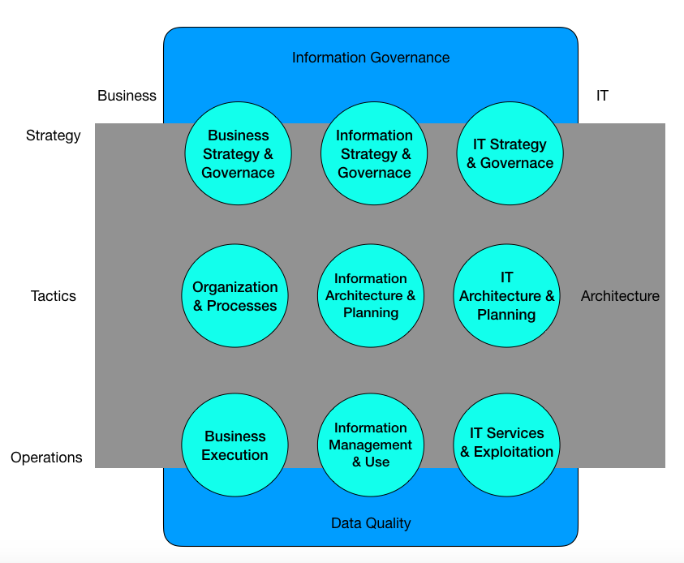
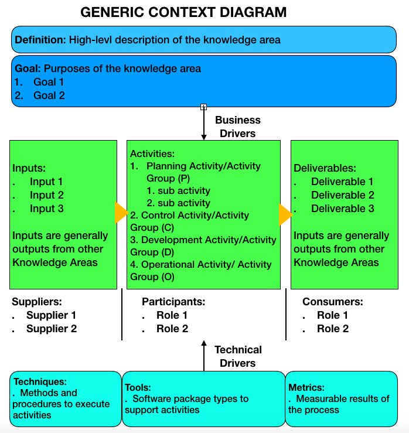

# CSCI 560 Spring 2020
# Chapter 1: Data Management
## 1 Introduction
### Data is a vital enterprise asset.
+ Data and information can 
  - give organizations insight about their customers, products, and services.
  - help organizations innovate and reach strategic goals.
+ Few organiztions take advantage of their data.
+ **Data management** helps organizations derive value from data.
+ Data and information are vital assets both in order to derive future value and day-to-day operations.

### Some Concepts
#### Data Management
+ is the development, execution, and supervision of plans, polices, programs, and practices that deliver, control, protect, and enhance the value of data and information assets throughout their lifecycles.

#### Data Management Professional
+ A **Data Management Professional** is any person who works in any facet of data management to meet strategic organizational goals
+ roles of Data Management Professional
  - highly technical
    + database administrators
    + network administrators
    + programmers
  - strategic business
    + data stewards
    + data strategists
    + chief data officer
+ Data management activities
  - technical
  - non-technical(business)
  - Both must be able to collaborate.

### Goals of data management
+ Understanding and supporting the information needs of the enterprise and its stakeholders, including customers, employees, and business partners
+ Capturing, storing, protecting , and ensuring the integrity of data assets.
+ Ensuring the quality of data and information
+ Ensuring the privacyand confidentiality of stakeholder data
+ Preventing unauthorized or inappropriate access, manipulation, or use of data and information
+ Ensuring data can be used effectively to add value to the enterprise
## 2. Essential Cocepts
### 2.1 Data
#### Definition
+ Long-standing definitions of **data** emphasize its role in representing facts about the world.
+ In relation to infromation technology, **data** is also understood as infromation that has been stored in digital form.
#### Characteristics
+ Digitization
+ More and more electronic versions of things have been considered as data.
  - videos
  - pictures
  - sound recording
  - documents
  - etc.
+ Volume and velocity
+ Reliable and extensible data management practices are required.
#### Metadata
+ Data is a means of representation, it stands for things other than itself.
+ We need context for data to be meaningful. If we know the  **conventions** of such a system, then we can interpret the data within it.
  - The conventions are often documented in a specific kind of data: Metadata.
#### Multiplicity
+ Multiple choices to represent data
+ Need for Data Architecture, modeling, governace, stwardship, metadata, data quality management...
### 2.2 Data and Information
+ Data: raw material of information
+ Information: data in context
+ Pyramid of Data, information, knowledge, and wisdom

+ Challenges here
  - It is based on the assumption that data simply exists, but data has to be created.
  - It takes knowledge to create data in the first place.
  - Data and infromation are not separate things, they are dependend on each other. 
    + Data is a form of information
    + Information is a form of data
    + Two terms will be used interchangeably

### 2.3 Data as an Organizational Asset
+ An **asset**
  - is an economic resource, that can be owned or controlled, and that holds or produces value.
  - can be converted to money.
+ Monetization of data is becomming increasingly common.
+ Organizations rely on data assets to make more effective decisions and to operate more efficiently.
  - **data-driven** 
    + efficient management
    + professional discipline
    + a partnership of business and technical expertise
+ Data management is not an option, it is the norm.

### 2.4 Data Management Principles

#### Data management characteristics
+ What data an organization has
+ What might be accomplised with the data
+ How best to use data assets to reach organizational goals.
#### Principles needed to balance strategic and operational needs

+ Data is an asset with unique properties
  - e.g. Data is not cosumed when it is used
+ The value of data can be and should be expressed in economic terms.
  - There are techniques for measuring data's qualitative and quantitative value
  - There are not standards
  - Organizations should develop consistant ways to quantify that value in order to make better choices.
  - The should also measure both the costs of low quality data and the benefits of high quality data
+ Managing data means managing the quality of data
  - Ensuring that data is fit for purpose is a primary goal of data management.
  - To manage quality, organizations must ensure they understand stakeholders' requirements for quality and measure data against these requirements.
+ It takes Metadata to manage data.
  - Metadata is the definition and knowledge needed to use data.
  - Metadata originates from data management activities.
+ It takes planning to manage data
  - from an architectural and process perspective
+ Data management is cross-functional; it requires a range of skills and expertise.
  - technical skills
  - non-technical skills
  - ability to collaborate
+ Data management requires an enterprise perspective
  - Data management and data governace are intertwined
+ Data management must account for a range of perspectives. (constantly envolve to keep up with)
  - the way data is created
  - the way data is used
  - the data consumers
+ Data management is lifecycle management
  - Data has a lifecycle
  - Data lifecycle is complex
+ Different types of data have different lifecycle charateristics
+ Managing data includes managing the risks associated with data
  - Data can be lost, stolen, or misused.
  - The ethical implications of data use.
  - Data-related risks must be managed as part of the data lifecycle.
+ Data management requirements must drive Information Technology decisions.
  - Data management and information technology are deeply intertwined.
  - Technologies need to serve, not drive, the strategic data needs.
+ Effective data management requires leadership commitment.

### 2.5 Data Management Challenges
Distinct characteristics +  principles => Challenges
#### 2.5.1 Data differs from other assets
+ Differences:
  - Data is not tangible.
  - Data is durable.(it does not wear out, though the value might change.)
  - Data is easy to copy and transport, but not easy to reproduce if it is lost or destroyed.
  - Data can be used for multiple purposes.
  - Data can be used by multiple people at the same time.
  - The use of data beget more data.
+ Challenges:
  - Not easy to put a monetary vaue on data
  - issues that affect data management
+ Benefits
  - Data, indeed, has value.
  - Data is a meta-asset that describe other assets.
  - Data and information are essential to conducting business between and within organizations.
#### 2.5.2 Data valuation
+ Value = Benefit - Cost
+ For data, neither benefit or cost are standardized.
+ General cost and benefit categories
  - Cost of obtaining and storing data
  - Cost of replacing data if it were lost
  - Impact ot organization if data were missing
  - Cost of risk mitigation and potential cost of risks associated with data
  - Cost of improving data
  - Benefits of higher quality data
  - What competitors would pay for data
  - What the data could be sold for
  - Expected revenue from innovative uses of data
+ Chanlleges
  - primary challenge: the value of data is contextual and often temporal
  - Within an organization, certain types of data are likely to be consistently valueable over time.
  - Establishing ways to associate value with data is critical
  - Putting value on data becomes the basis of putting value on data management activities.
#### 2.5.3 Data quality
+ Ensuring that data is of high quality is central to data management.
+ Poor quality data will have negative impact on the decisions of organizations.
  - Organizations spend between 10-30% revenue handling data quality issues.
  - the esitmated cost of poor data in US in 2016 was $3.1 Trillion.
+ Costs come from
  - Scrap and rework
  - work-arounds and hidden correction processes
  - Organizational inefficiencies or low productivity
  - Organizational conflict
  - Low job satisfaction
  - Opportunity costs, including inability to innovate
  - Compliance cost or fines
  - Reputational costs
+ Benifits of high quality data
  - Improve customer experience
  - Higher productivity
  - Reduced risk
  - Ability to act on opportunities
  - Increase revenue
  - Competitive advantage gained from insights on customers, products, and oppotunities.
#### 2.5.4 Planning for Better Data
+ Deriving value from data starts from planning for better data.
+ Decisions about data involve:
  - The way data connects business processes that might otherwise be seen as separate
  - The relationship between business processes and the technology taht support them
  - The design and architecture of system and the data they produce and store
  - The way data might be used to advance organizational strategy
+ Planning for Better Data depends on
  - a strategic approach to architecture, modeling, and other design functions.
  - strategic collaboration between business and IT leadership.
  - the ability to execute effectively on individual projects
+ Challenge
  - organizational pressures and the prennial pressures of time and money
+ Solution
  - Having clarity about the trade-off between long- and short-term goals
#### 2.5.5 Metadata and Data Management
+ Metadata describes
  - what data an organization has
  - what data represents
  - how it is classified
  - where it came from
  - how it moves within the organization
  - how it envoles through use
  - who can and cannot use it
  - whether it is of high quality
+ Challenge:
  - Metadata is a form of data and needs to be managed
  - Metadata often provides a starting points for improvements in data manamgement overall.
#### 2.5.6 Data management is cross-functional
+ range of skills for data management
  - design skills to plan for systems
  - highly technical skills to adiminister hardware and build software
  - data analysis skills to understand issues and problems
  - analytic skills to interpret data
  - language skills to bring consensus to definitions and models
  - strategic thinking to see opportunities to server customers and meet goals
+ challenge
  - getting people with this range of skills and perspectives to recognize how the piece fit together so that they collaborate well as they work toward common goals.
#### 2.5.7 Establishing an enterprise perspective
+ Managing data requires understanding the scope and range of data within an organization.
+ Data is not unique to an organization
+ Data originates in multiple places within an organization
+ Challenge
  - Differences in representational choices
+ Solution
  - data governance
#### 2.5.8 Accouting for other perspectives
+ Different legal and compliance requirements across national and industry lines
+ Knowledge of the potential use of data
+ Risks of the misuse of data
### 2.5.9 The Data Lifycycle

+ Challenges
  - As data is used or enhanced, new data is often created. Data is rarely static.
  - lineage/data chain: a pathway along which it moves from its point of origin to its point of usage.
    + Lineage requires documenting the orginal data sets and theire movement and transformation through system.
+ Implications
  - Creation and usage are the most critical points in the data lifycycle.
  - Data Quality must be managed throughout the data lifecycle.
  - Metadata Quality must be managed throughout the data lifecycle.
  - Data Security must be managed throughout the data lifecycle.
  - Data management efforts should focus on the most critical data
#### 2.5.10 Different Types of Data
+ Data can be classified by 
  - type:
    + transactional data
    + Reference data
    + master data
    + metadata
    + alternatively category data
    + ...
  - content 
    + data domain
    + subject area
  - format
  - level of protection
  - how and where it is stored or accessed
+ Chanllenge: different types of data => different
  - requirements
  - risks
  - roles within the organization
+ Solution: Many of the tools of data management focus on aspects of classification and control.
#### 2.5.11 Data and Risks
+ Low quality data is risky because  its information is not correct.
+ High quality data is risky because it can be misunderstood and misused.
  -  e.g.: the information gap: The difference between what we know and what we need to know to make an effective desicion
+ focus by regulators and legislators on the potential uses and abuses of information.
+ Comstomers become more aware of how their data is used.
#### 2.5.12 Data management and technology
+ Data management is strongly infuenced by technology.
+ data requirments aligned with business stratey should drive decisions about technology. (prevent technological temptation from driving their decisions about data)
#### 2.5.13 Effective data management requires leadership and commitment
+ Organizations are far from being data-driven, even they recognize their data as an asset.
+ They do not know data management
+ They underestimate data management
+ Changllenge:
  - to become better at data management requires vision, planning, and willingness to change.
+ **Chief Data Office (CDO))
  - leads inititives of data management
  - leads cultural change within an organization
### 2.6 Data Management Strategy
+ Strategy:
  - is a set of choices and decisions that together chart a high-level course of actions to achieve high-level goals.
+ A data strategy should includes business plans to use information to competitive advantage and support enterprise goals.

## 3. Data Management Frameworks
+ Why frameworks are needed?
  - Data management involves a set of interdependent functions, each with its own goals, activities, and responsibilities.
  - Data management professionals' tasks are also very complicated.
  - Frameworks developed at different levels of abstractions provide a range of perspective on how to approach data management.
### 3.1 Strategic Alignment Model (SAM)
+ abstracts the fundamental drivers for any approach to data management.
+ center: the relationship between data and information.
+ Information is most often associated with business strategy and the operational use of data
+ Data is associated with information technology and processes which support physical management of systems that make data accessible for use.
+ 4 fundamental domains of strategic choice:
  - business strategy
  - information technology strategy
  - organizational infrastructure and processes
  - information technology infrastracture and prcocesses
  

+ **Note:** the fully articulated strategic alignment model complex than is illustrated in figure above.

### 3.2 The Amsterdam Information Model (AIM)
+ takes a strategic perspective on business and IT alignment(Known as 9-cell)
+ a middle layer that focuses on structure and tactics, including planning and architecture
+ the necessity of information communication(the Information Governace and Data Quality pillar in figure below)
+ **Note:** Both SAM and AIM describe in detail the relation between the components, from a horizontal (Business/IT) and vertical (Business strategy/Business Operations) perspective.  

### 3.3 The DAMA-DMBOK Framework
+ DAMA Wheel
  - defines the **Data Management Knowledge Areas**
  - places **data governace** at the center
  - balances other activities around the wheel.(all parts are necessay, but may be implemented at different time.)

+ Enviromental Factors hexagon
  - shows the relationship between people, process, and the technology 
  - provides a key for reading the DMBOK context diagram.
  - puts gols and principles at the center

+ Knowledge Area Context Diagram

  - describes the detail of the Knowledge Areas
  - puts activities at the center, since they produce the deliverables that meets the requirements of stakeholders.
  - begins with definition and goals.
  - classifies activities into 4 phases: P, D, O, C
  - has inputs and suppliers on the left,  deliverables and comsumsers on the right, participants below activities, Tools, techniques, and metrics on the bottom.

### 3.4 DMBOK Pyramid (Aiken)

+ DMBOK Pyramid (Aiken) describes how organizations evolve toward better data management practices

+ Phase 1: The orgranization purchases an application that includes database capabilities.
+ Phase 2: The orgranization gets reliable metadata and consistent Data Architecture for higher quality data(Displined practices for mananging Data Quality, Metadata, and architecture) 
+ Phase 3: Data Governace
+ Phase 4: The orgranization leverages the benefits of well-managed data and advances its analytic capabilities.

### 3.5 DAMA Data Management Framework Evolved

+ DAMA Functional Area Dependencies
  - Anoter way to look at DAMA Knowledge Areas is to explore the dependencies between them.

+ DAMA Management Function Framework
  - The third way draws aon architectural concepts to propose a set of relationships between DAMA Knowledge Areas by providing additional details about the content of some Knowledge Areas.

+ DAMA Data Management Framework can also be depicted as an evolution of the DAMA Wheel.

## 4. DAMA and the DMBOK
+ DAMA: Data Management Association International
  - DAMA was founded to address challenges in data management.
+ DMBOK:  The DAMA Guide to the Data Management Body of Knowledage
  - an accessible, authoritative reference book for data management professionals.
    + providing functional framework
    + establishing a common vocabulary
    + serving as the fundamental reference guide
  - 11 Knowledge Areas
    + Data Governance
    + Data Architecture
    + Data Modeling and Design
    + Data Storage and Operations
    + Data Security
    + Data Integration and Interoperability
    + Document and Content Management
    + Reference and Master Data
    + Data Warehousing and Business Intelligence
    + Metadata
    + Data Quality
  - Other topics
    + Data Handling Ethics
    + Big Data and Data Science
    + Data Mangement Maturity Assessment
    + Data Mnagement Organization and Role Expectations
    + Data Management and Organization Change Management
