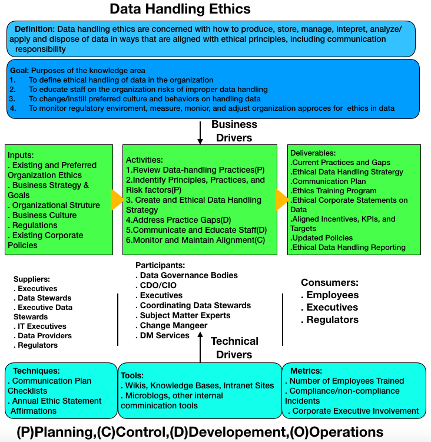

# CSCI 560 Spring 2020
# Chapter 2: Data Handling Ethics

# Dr. Ning Zhang

# 1. Introduction
## Definitions
+ Ethics
  - are principles of behavior based on ideas of right and wrong.
+ Ethic principles
  - fairness
  - respect
  - responsibility
  - integrity
  - quality
  - reliability
  - transparency
  - trust
+ Data handling ethics
  - are concerned with how to produce, store, manage, use, and dispose of data in ways that are aligned with ethical principles.
## Data handling ethics are necessary
  - Ethical data handling helps organizations get value from data in long-term
  - Unethical data handling can result in the loss of reputation and customers, and it is illegal in some cases.
## Core concepts of ethical data handling
  - Imapact on people
  - Potential for misuse
  - Economic value of data
    + Ethics of data owenership shoud determine how that data value can be accessed and by whom
## Laws and regulatory requirements vs. Ethics

## protect data vs. manage data quality
  - People making decisions, as well as those impacted by decisons, expect data to be complete and accurate.
  - low quality data
    + data that mispresent, is misused, or is misunderstood.
    
## Context Diagram 
+ Review of the Generic Context Diagram of the DAMA-DMBOK Framework

+ Data handling ethics context diagram

## Summary
+ Many organizations fail to recognize and respond to the ethical obligations inherent in data management.
+ The data enviroment is evolving rapidly. While laws codify some ethical principles, legislation cannot keep up with the risks assocaited with evoluton of the data enviroment.

# 2. Business Drivers
+ An ethical approach to data use is increasingly being recognized as a competive business advantage.  Ethical data handling can 
  - increase the trustworthiness of an organization and the organization's data and process outcomes,
  - create better relationships between the organization and its stakeholders,
  - reduce the risk that data for which the organization is responsible will be misused by employees, customers, or partners,
  - secure data from criminals(Chapter 7)
  - adapt to the influence of  different modles of data ownership, and the emerging roles of Chief Data Officer, Chief Risk Officer, Chierf Privacy Officer, and Chief Analytics Officer.
  
  

# 3. Essential Concepts

## 3.1 Ethical Principles for Data
### Human dignity(starting point for pinciples of data ethics) and automony - **Belmont Report**
+ **Principle 1**: respect for persons
  - repsect their dignity and autonomy as human individuals
+ **Principle 2**:Beneficence
  - minimize risk of harm
  - maximize benefit
+ **Principle 3**:Justice
  - fair and equitable treatment of people 
+ **Principle 4**: Respect for Law and Public Interest (added by The United States epartment of Home Security's **Menlo Report**)

### Privacy - EDPS(European Data Protection Supervisor)
+ Future-oriented regulation of data processing adn respect for the rights to privacy and to data protection
+ Accountable controllers who determine personal information processing
+ Privacy conscious engineering and design of data processing products and services
+ Empowered individuals

### Summary
+ Dignity, automony, and privacy is a platform on which a sustainable digital enviroment is shaped.
+ Data governance is a vital tool for ensuring these principles.

## 3.2 Principles Behind Data Privacy Law
+ General Data Protection Regulation onf the EU (GDPR, 2016)

## 3.3 Online Data in an Ethical Context

## 3.4 Risks of Unethical Data Handling Practices

### 3.4.1 Timing

### 3.4.2 Misleading Visualizations

### 3.4.3 Unclear Definitions or Invalid Comparisions

### 3.4.4 Bias

### 3.4.5 Transforming and Integrating Data

### 3.4.6 Obfuscation/Redaction of Data

## 3.5 Establishing an Ethical Data Culture

### 3.5.1 Review Current State Data Handling Practices

### 3.5.2 Identify Priciples, Practices, and Risk Factors

### 3.5.3 Create an Ethical Data Handling Srategy and Roadmap

### 3.5.4 Adopt a Socially Responsible Ethical Risk Model

## 3.6 Data Ethics and Governance

