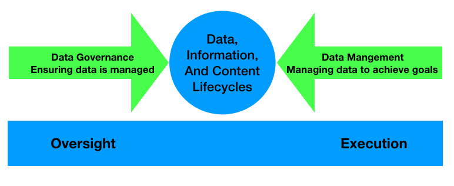
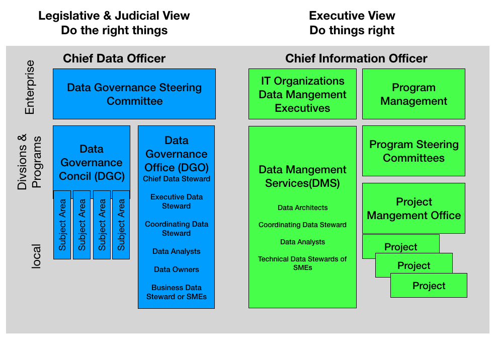
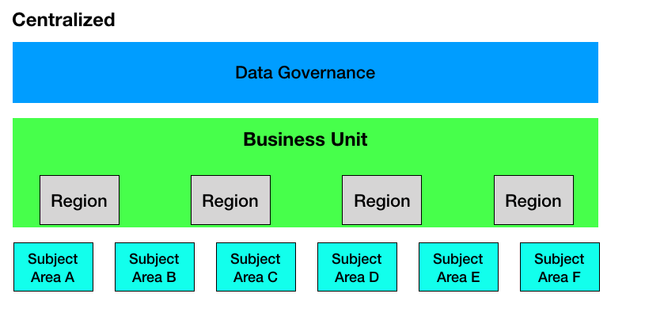
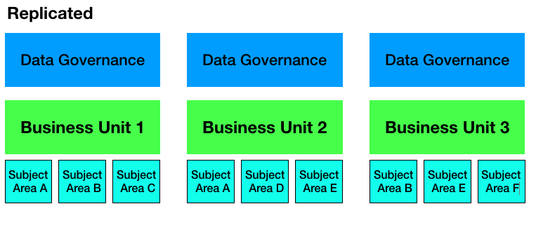
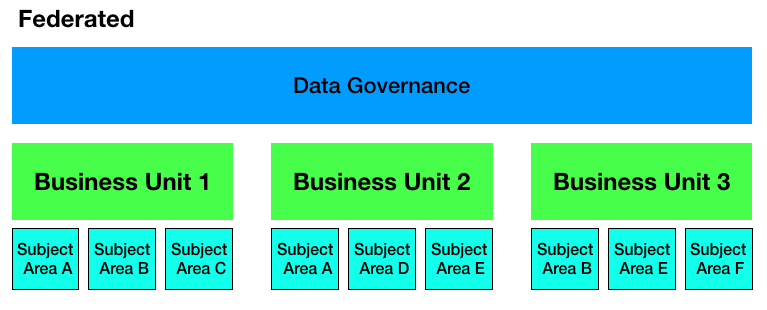
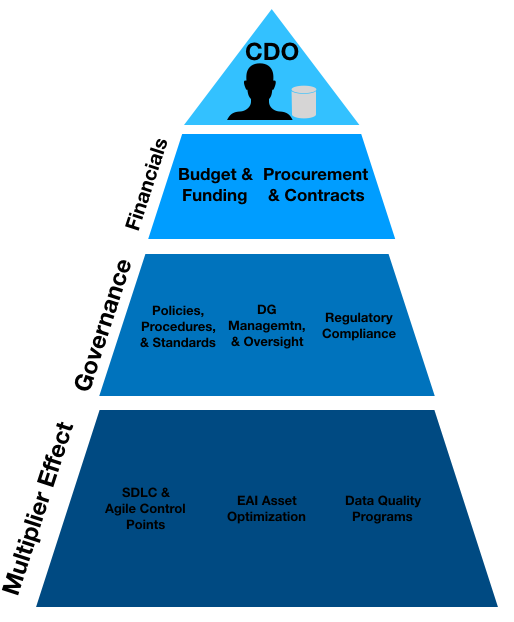
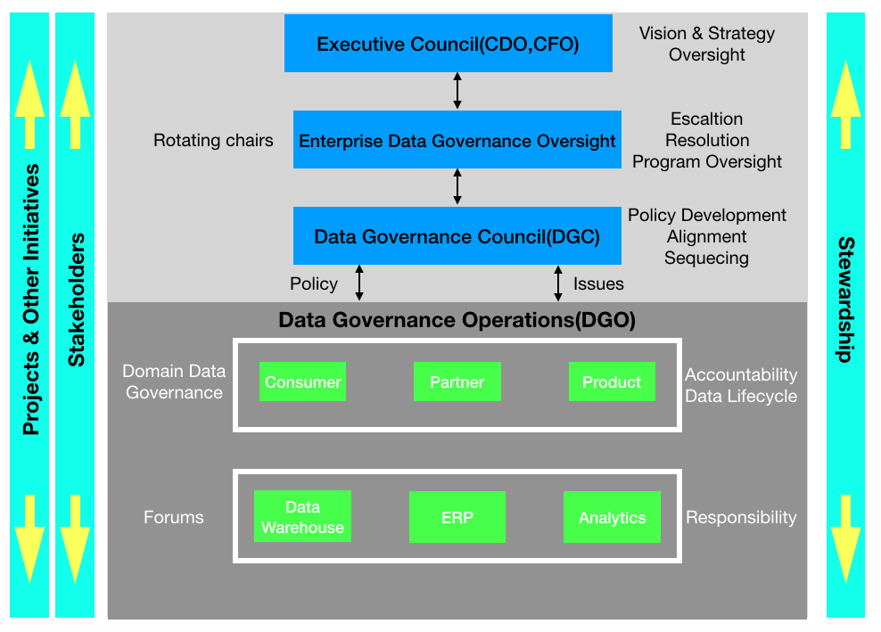

# CSCI560 Spring 2020
# Chapter 3: Data Governance
# Dr. Ning Zhang

# Introduction

## Definition
+ Data Governance is the exercise of authority and control(planning, monitoring, and enforcement) over the mangement of data assets.
+ Data Governane professionals sets rules for managing data assets, other areas carry out these rules.
## Why Data Governance?
+ All organizations make decisions about data.
+ Organizations that establish a formal Data Governance program exercise of authority and control with greater intenionality are better able to increase the value they get from their data assets.

## Purpose
+ to ensure that data is managed properly, according to policies and practices
## Scope and focus
+ How decisions are made about data and how people and processes are expected to behave in relation to data. 
  - Strategy
    + Defining, communicating, and driving execution of Data Strategy and Data Governance Strategy
  - Policy
    + setting and enforcing policies related to data and Metadata management, access, usage, security, and quality.
  - Standard and quality
    + setting and enforcing Data Quality and Data Architecture Standards
  - Oversight
    + Providing hands-on observation, audit, and correction in key areas of quality, policy, and data management(often referred to as stewardship)
  - Compliance
    + Ensuring the organization can meet data-related regulatory comppliance requirements
  - Issue Management
    + Identifying, defining, escalating, and resolving issues related to data security, data access, data quality, regulatory compliance, data ownership, policy, standards, terminology, or data governace procedures.
    
  - Data management projects
    + Sponsoring efforts to improve data mangement practices
  - Data asset valuation
    + Setting standards and processes to consistently define the business value of data assests
    
    
    
    
    
  ## 1.1 Business Drivers
 + Reducing Risk
  - General risk management
    + risks to finances or reputation, including response to legal and regulatory issues.
  - Data security
  - Privacy
 + Improving Processes
  - Regulatory compliance
  - Data quality improvement
  - Metadata management
  - Efficieny in development projects
  - Vendor management
    + control of contracts dealing with data
  
  ## 1.2 Goals and Principles
  ### Goals
  + The overall goal of DG is to enable an organization to manage data as an asset.
  + To achieve it, a DG program must be
    - Sustainable: DG necessirates changes in how data is managed and used.
    - Embedded: DG activities need to be incorporated into development methods for softwares, use of data for analytics, mangement of Master Data, and risk management.
    - Measured
  ## Principles
  + Leadership and strategy
    + DG starts with leadership
    + DG is guided by a data strategy(data strategy is driven by the enterprise business strategy)
  + Business-driven
  + Shared responsibility
    - DG must govern IT decisions related to data
  + Multi-layered
    - local layer
    - enterprise layer
    - often in-between
  + Framework-based
    - establish an operating framework for coordination across functional areas
  + Principle-based
  
  ## 1.3 Enssential Concepts
  + DG ensures data is properly used without directly executing data management.
  + DG represents an inherent separation of duty between oversight and execution.
  
  
  
  ### 1.3.1 Data-centric Organization
  + Data should be managed as a corporate asset.
  + Data management best practices should incented across the organization
  + Enterprise data strategy must be directly aligned with overall business strategy.
  + Data management processes should be continuously improved.
  ### 1.3.2 Data Governance Organization
  + Each organization should 
    - adopt a **governance model**.
    - be prepared to envolve the model to meet new challenges.
    
  + Generic data governance model
    - activities at different levels within the  organization (vertical axis)
    - separtion of governance responsibilities within the organizational functions and between IT and business areas.
  
   
   
  + typical Data Governance Committees/Bodies 
  
  |Data Governance Body|Description|
  |---|---|
  |Data Governance Steering Committee|The primary and highest authority organization for data governance in an organization, responsible for oversight, support, and funding of data governance activities. Consists of a cross-functional group of senior executives.   Typically releases funding for data governance and data governance-sponsored activites as recommended by the DGC and CDO. This committee may in turn have oversight from higher-level funding or initiative-based steering committees.|
  |Data Governance Council(DGC)|Manages data governance initiatives, issues, and escalations. Consists of executive according to the operating model used.|
  |Data Governance Office(DGO)|Ongoing focus on enterprise-level data definitions and data management standards across all DAMA-DMBOK Knowledge Areas. Consists of coordinating roles that are labelled as data stewards or custodians, and data owners.|
  |Data Stewardship Teams| Communities of interess focused on one or more specific subject-areas or projects, collaborating or consulting with project teams on data definitions and data management standards related to the focus. Consists of business and technical data stewards and data analysts.|
  |Local Data Governace Committee|Large organizations may have divisional or departmental data governance councils working under the auspices of an Enterprise DGC. Smaller organizations should try to avoid such complexity.|
  
  
   
  ### 1.3.3 Data Governane Operating Model Types
  
   
    
   
   
   
  ### 1.3.4 Data Stewardship
  + Definition
    - is the most common label to describe accountability and responsibility for data and processes that ensure effective control and use of data assets.
  + Activities
    - Creating and managing core Metata
    - Documenting rules and standards
    - Managing data quality issues
    - Executing operational data governance activites
  ### 1.3.5  Types of Data Stewards
  Data stewards manage data assets on behalf of others and in the best intersts of the organization.
  + Chief Data Stewards
  + Executive Data Stewards
  + Enterprise Data Stewards
  + Business Data Stewards
  + A Data Owner
  + Technical Data Stewards
  + Coordinating Data Stewards
  
  **The best Data Stewards are often found, not made.**
  
  ### 1.3.6 Data Polices
  + describe what to do and what not to do.
  + There should be relatively few policies
  + They should be stated briefly and directly.
  
  ### 1.3.7 Data Asset Valuation
  + Lifecycle benefits and cost
  + Replacement cost
  + Market value
  + Identified opportunities
  + Selling data
  + Risk cost
  
  #### Principles for Data Asset Accouting
  
  |Principle|Description|
  |---|---|
  |Accoutability Principle|An organization must identify individuals who are ultimately accountable for data and content of all types|
  |Asset Principle|Data and content of all types are assets and have characteristics of other assets. They should be managed, secured, and accounted for as other material or financial assets|
  |Audit Principle|The accuracy of data and content is subject to periodic audit by an independent body|
  |Due Diligence Priciple|If a risk is known, it must be reported. If a risk is possible, it must be confirmed. Data risks include risks related to poor data management practices.|
  |Going Concern Principle|Data and content are critical to successful, ongoing business operations and management|
  |Level of Valuation Principle|Value the data as an asset at a level that makes the most sense, or is the easiest to measure.|
  |Liability Principle|There is a financial liability connected to data or content based on regulatory and ethical misuse or mismanagement|
  |Quality Principle|The meaning, accuracy, and lifecycle of data and content can affect the financial status of the organization.|
  |Risk Principle|There is risk associated with data and content. This risk must be formally recognized, either as a liability or through incurring costs to manage and reduce the inherent risk.|
  |Value Principle|There is value in data and content, based on the ways there are used to meet an organization's objectives, their intrinsic marketability, and/or their contribution to the organization's goodwill(balance sheet) valuation. The value of informatin reflects its contribution to the organization offset by the cost of maintenance and movement.|
  
  
  
  
  # 2 Activities
  
  ## 2.1 Define Data Governance for the Organization
  + What is being governed?
  + Who is being governed?
  + Who is governing?
  
  ## 2.2 Perform Readiness Assesment
  Typical assessments include:
  + Data management maturity  
    - how well the organization manages data and uses data to its advantages
    - objective criteria
  + Capacity to change
  + Collaborative readiness
  + Business alignment
    - how well the organization uses of data with business strategy
  
  
  ## 2.3 Perform  Discovery and Business Alignment
  + Discovery activity will identify and assess the effectiveness of existing policies and guidelines
  
  ## 2.4 Develop Organizational Touch Points
  + Chief Data Officer (CDO) organizational Touch Points
    - supports alignment and cohesiveness of an enterprise data governance and data management approach in areas outside the direct authority of the CDO.
    - provides a vision of how DG will be perceived by the organization.
    
    
  
  ## 2.5 Deveop Data Governace Strategies
  + A data governance startegy defines the scope and approach to governance efforts.
  + related to business strategy, data management strategy, and IT strategy.
  + should be implemented iteratively as the pieces are developed and approved.
  + deliverables
    - Chater
      + identifies the business drivers, vision, mission, and principles for DG
    - Operating framework and accountabilities
      + defines structure and resonsibilities for DG activiteis.
    - Implementation roadmap
      + timeframe
    - Plan for operaional success
  
  ## 2.6 Define the DG Operating Framework
  + Considering these areas when constructing an DG operating framework
    - Value of data to the organization
    - Business model
      + Decentralized vs centralized
      + local vs international
    - Cultural factors
    - Impact of regulation
  + An example
  
  
  
  ## 2.7 Develop Goals, Principles, and Polices
  
  ## 2.8 Underwrite Data Management Projects
  
  ## 2.9 Engage Change Management
  
  ## 2.10 Engage in Issue Management
  
  ## 2.11 Assess Regulatory Compliance Requirements
  
  ## 2.12 Implement Data Governane
  
  ## 2.13 Sponsor Data Standards and Procedures
  
  ## 2.14 Develop a Business Glossary
  
  ## 2.15 Coordinate with Architecture Groups
  
  ## 2.16 Sponsor Data Asset Valuation
  
  ## 2.17 Embed Data Governance
  
  # 3 Tools and Techniques
  
  ## 3.1 Online Presence / Website
  
  ## 3.2 Business Glossary
  
  ## 3.3 Workflow Tools
  
  ## 3.4 Document Management Tools
  
  ## 3.5 Data Governance Scorecard
  
  # 4 Implementation Guide
  ## 4.1 Organizational and Culture
  
  ## 4.2 Adjustment and Communication
  
  # 5 Metrics
 
