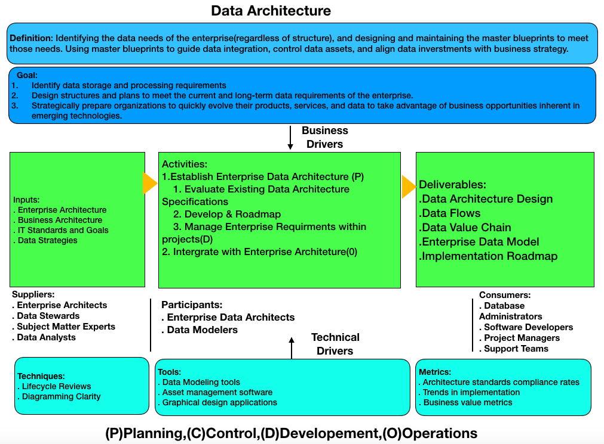

# CSCI 560 Spring 2020
# Dr. Ning Zhang
# Chapter 4: Data Architecture

# 1. Introduction
+ Architecture
  - Art and science of building things
  - Results of the process of building
+ Architecture
  - a description of current state of systems
  - the components of a set of systems
  - the disciplines of designing systems(architecuture practice)
    + different levels
    + different areas of focus
  - the intentional design of a system or a set of systems(future state or proposes architeture)
  - the artifacts that describe a system(architecture documentation)
    + describe existing state
    + define data requrements
    + guide data integration
    + control data asset
  - the team that does the design work (the Architects or the Architecture team)
+ Data Architecture is fundamental to Data Management
  - it is necessary to represent organizational data at different levels of abstraction so that it could be understood and managed
    + abstractions that include standards that govern how data is collected, stored, arraged, used, and removed.
    + descriptions of all the containers and paths that data takes through an organization's system
    
+ formal enterprise data model
  - the most detailed Data Architecuture design document
  - contains
    + data names
    + comprehensive data
    + metadata definitions
    + conceptual and logical entities and relationships
    + business rules
    
    
  

## 1.1 Business Drivers
+ Data Architecture is to be a bridge between business strategy and technology execution
  - Strategically prepare organizations to quick evlove their products, services, and data to take advantage of business oppotunities inherent in emerging technologies.
  - Translate business needs into data and system requirements so that processes consistently have the data they require
  - Manage complex data and information delivery throughout the enterprise
  - Facilitate alignment between Business and IT
  - Act as agents for change， transformatin, and agility.

## 1.2 Data Architecture Outcomes and Practices
### Outcomes
+ Data storage and processing requrements
+ Designs of structures and plans that meet the current and long-term data requirements of the enterprise
### Specifications
+ Define the current state of data in the organization
+ Provide a standard business vocabulary for data and compoents
+ Align Data Architecture with enterprise strategy and business architecture
+ Express strategic data requirements
+ Ooutline high-level integrated designs to meet these requirements
+ Integrate with overall enterprise architecture raodmap
### Practices
+ Using Data Architecture artifacts(master blueprints) to define data requirements, guide data integration, control data assets, and align data investments with business strategy.
+ Collabrating with, learning from and influencing various stakeholders that are engaged with improving the business or IT systems development
+ Using Data Architecture to establish the semantics of an enterprise, via a common business strategy.

## 1.3 Essential Concepts
### 1.3.1 Enterprise Architecture Domains
+ Data Architecture operates in context of other architecture domains.
+ Architects from different domains must addres development directions and requirements collaboratively.

|Domain|Enterprise Business Architecture|Enterprise Data Architeture|Enterprise Application Architecture|Enterprise Technoligy Architecture|
|----|----|----|----|----|
|Purpose|To identify how an enterprise creates value for customers and other stakeholders|To describe how data should be organizaed and managed|To describe the structure and functionality of applications in an enterprise|To describe the physical technology needed to enable systems to function and deliver value|
|Elements|Business models, processes, capabilities, services, events, strategies, vocabulary|Data models, data definitions, data mapping specifications, data flows, structured data APIs|Business systems, software packages, databases|Technical platforms, networks, security, integration tools|
|Dependencies|Establish requirements for the other domains|Manage data created and required by business architecture|Acts on specified data according to business requirements|Hosts and executes the application architecture|
|Roles|Business architects and analysts, business data stewards|Data Architect and modelers, data stewards|Applications architects|Infrastructure architects|

### 1.3.2 Enterprise Architecture Frameworks
+ is "architecture of architecture"
+ Zachman framework for enterprise architecture
  - is an ontology
  - does not define how to create a model, simply shows what model should exist
  - columns: **communication interrogatives** 
    + What: entities used to build the architecture
    + How: activities performed
    + Where: business location and technology location
    + Who: Roles and organizations
    + When: Intervals, events, cycles, and schedules
    + Why: Goals, strategies, and means
  - rows: **reification transformations**
    + executive perspective(business context): List of business elements defining scope in identification models
    + business management perspective(business concepts): Clarification of the relationships between business concepts defined by Executive Leaders as Owners in definition models
    + architect perspective(business ligic): System logical models detailing system requirements and unconstrained design represented by Architects as Designers in representation models.
    + engineer perspective(business physics): Physical models optimizing the design for implementation for specific use under the constraints of specific technology, people, costs, and timeframes specified by Engineers as Builders in specification models.
    + technician perspective(component assemblies): A technology-specific, out-of-context view of how components are assembled and operate configured by Technicians as Implementers in configuration models.
    + user perspective(operation classes): Actual functioning instances used by Workers as Participants. There are no models in this perspective.
  - each cell represents a unique type of design artifact.

### 1.3.3 Enterprise Data Architecture
+ Enterprise Data Model(EDM)
+ Data Flow Design

#### Enterprise Data Model(EDM)
+  is composed of data models from different perspectives and at different levels of details
+ describe data entities, data attributes, and their realationships across the enterprise.
+ includes both universal(conceptual and logical models) and application- or project-specific data models
+ mostly is built increamentally and iteratively.

+ vertical: models in each level maps to models in other levels
+ horizontal: entities and relationships may appear in multiple models in the same level.

+ Each Subject Area Diagram contains a conceptual data model with a set of entities.
+ Relationships may cross Subject Area borders
+ Each entity in an EDM should reside in only one Subject Area, but can be related to entities in any other Subject Area.

+ Subject Area discriminator principles:
  - **normalization rules**
  - dividng Subject Area from system portfolios (funding)
  - forming Subject Area from data governance structure and data ownership(organizational)
  - using top-level processes (based on the business value chairs)
  - using business capabilities(enterprise architecture-based)
 
#### Data Flow Design
+ Data flows map and document relationships between data and
  - Applications within a business process
  - Data stores or databases in an enviroment
  - Network segments (useful for security mapping)
  - Business roles, depicting which roles have responsibility for creating, updating, using, and deleting data (CRUD:create, read, update, and delete)
  - Locations where local difference occur

+ Data flows can be represented by two-dimensional matrices

+ Data flows can also be represented by data flow diagram.
  - data flow between systems

# 2. Activities
## 2.1 Establish Data Architecture Practices
## 2.2 Integrate with Enterprise Architecture

# 3. Tools
## 3.1 Data Modeling Tools
## 3.2 Asset Management Tools
## 3.3. Graphical Design Applications

# 4. Techniques
## 4.1 Lifecycle Projections
## 4.2 Diagramming Clarity

# 5. Implementation Guideline
## 5.1 Readiness Assessment / Risk Assessment
## 5.2 Organization and Cultrual Change

# 6. Data Architecture Governance
## 6.1 Metrics
