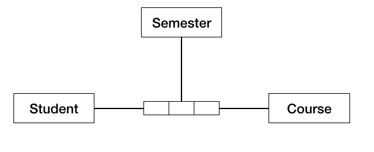
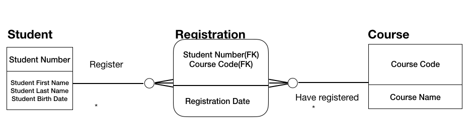

# CSCI 560 Spring 2020
# Dr. Ning Zhang
# Chapter 05: Data Modeling and Design

# 1. Introduction

+ Six most commonly used schemes
  - Relational
  - Dimensional
  - Object-Oriented
  - Fact-Based
  - Time-Based
  - NoSQL
+ Three levels
  - Conceptual
  - Logical
  - Physical
  - More details [here](https://www.guru99.com/data-modelling-conceptual-logical.html)
## 1.1 Business Drivers
+ Data models are critical to effective management of data, they
  - Provide a common vocabulary around data
  - Capture and document explicit knowledge about an organization's data and system
  - Serve as a primary communications tool during projects
  - Provide the starting point for customization, integration, or even replacement of an application
## 1.2 Goals and Principles
+ Confirming and documenting understanding of different perspectives, which facilitates:
  - Formalization: concise definition of data structure and relationships
  - Scope definition: boundaries for data context and implementation of purchased application packages, projects, initiaties, or existing systems
  - Knowledge retention/documentation: corporate memory regarding a system of project by capturing knowledge in an explicit form.
## 1.3 Essential Concepts
### 1.3.1 Data Modeling vs. Data Models
+ Data modeling
  - the understanding of the organizational data
+ Data models
  - a data model contains a set of symbols with text labels that attempts visually to represent data requirements as comminicated to the data modeler.
### 1.3.2 Types of Data
+ Category informaton
  - customers classified by market categories or business sectors
  - products classified by color, model
  - orders classified by whether they are open or closed

+ Resource information(reference data)
  - basic profile of resources needed conduct operational processes
    + product
    + customer
    + supplier
    + facility
    + organization
    + account
+ Business event information(transactional business data)
  - Data created while operational process such as
    + customer order
    + supplier invoice
    + cash withdrawal
    + business meeting
+ Detail transaction information(Big Data)
  - produced through point-of-sale systems
    + social media systems
    + other internet interactions
    + sensors in machines
    + personal devices
### 1.3.3 Data Modeling Components
+ Entities
+ Relationships
+ Attributes
+ Domains

#### Entities
+ An entity is a thing about which an organization collects information.
+ An entity can be thought of as an answer to a fundamental question
  - who
  - what
  - when
  - where
  - why
  - how
  
  
|Category|Definition|Examples|
|----|----|----|
|Who|Who is important to the business?|Employee, Patient, Player, Suspect, Customer, Vendor, Student, Passenger, Competitor, Author|
|What|What the organization makes or what service it provides? What is important to the business?|Product,Service, Raw Material, Finished Good, Course, Song, Photograph, Book|
|When|When is the business in operation?|Time, Date, Month, Quater, Year, Calendar, Semester, Fiscal Period, Minute, Department Time|
|Where|Where is business conducted?|Mailing Address, Distribution Point, Website URL, IP address|
|Why|Why is the business in business?|Order, Return, Complaint, Withdrawal, Deposit, Compliment, Inquiry, Trade, Claim|
|How|How do we know that an event occur?|Invoice, Contract, Agreement, Account, Purchase Order, Speeding Ticket, Packing Slip, Trade Confirmation|
|Measurement|Count, sum, etc. of other categories|Sales, Item Count, Payments, Balance|

+ Entity Aliases

|Scheme|Entity Alias|
|---|---|
|Common Use|Entity Type|
|Relational|Entity|
|Dimensional|dimension/fact table|
|object-oriented|class/object|
|time-based|hub/satellite/link|
|NoSQL|document/node|

|level of detail|Entity Alias|
|---|---|
|Conceptual|concept/term|
|Logical|entity or others depending on scheme|
|Physical|table|

+ Graphic Representation of Entities
  - Rectangles (or rectangles with round endges) with their names inside
  
  

+ Definition of Entities
  - **they are core Metadata**
  - characteristics
    + Clarity
    + Accuracy
    + Completeness

#### Relationships
A relationship captures 
  - the high-level interactions between conceptual entities
  - the detailed interactions between logical entities
  - the constraints between physical entities
+ Relationship Aliases

|Scheme|Relationship Alias|
|---|---|
|Relational|Relationship|
|Dimensional|Navigation path|
|NoSQL|edge/link|

|level of detail|Relationship Alias|
|---|---|
|Conceptual|Relationship|
|Physical|Constraint/Reference|

+ Graphic Representation of Relationship
  - lines on the data modeling diagram
  
    
    
    
+ Relationship Cardinality
  - caputures how many of one entity  participates in the relationship with how many of other entity
  - is reprented by the symbols that appear on both ends of a realtionship line
  - example: in the Student-Course relationship, the business rules are
    + Each Student may attend one or many Courses
    + Each Course may be attended by one or many Students
  
  
+ Arity of Relationships: the number of entities in a relationship
  - **Unary**(Recursive) Relationship: one entity
    + one-to-many describes a hierachy
      - child entities are on the many side
      - parent entities are on the one side
      
       
      
    + many-to-many describes a network or graph

       
       
  - **Binary** Relationship: two entities
  
      
      
  - **Ternary** Relationship
    + example: **Student** can register for a particular **Course** in a given **Semester**
    
      
  - Foreign Key
    + used in physical and sometimes logical relational data modeling schemes
    + example:
    
    
    
#### Attributes
+ Definition:
  - an attribute is a property that identifies, describes, or measures an entity.
+ Graphic Representation of Attribute
  - Student include
    + Student Number
    + Student First Name
    + Student Last Name
    + Student Birth Date
    
+ Identifiers
  - An identifier(key) is a set of one or more attributes that uniquely defines an instance of an entity.
  - Construction-type keys
    + simple key: one attribute that uniquely identifies an entity instance.
    + surrogate key: an integer whose meaning is unrealted to its face value
      - surrogate keys serve technical functions and should not be visible to end users of a database.
    + compound key: two or more attributes that uniquely identify an entity instance.
    + composite key: one compound key and at least one other simple or compound key or non-key attribute
  - Function-type keys
    + super key: any set of attributes that uniquely identify an entity instance.
    + candidate key: a minimal set of one or more attributes that uniquely identify an entity instance.
    + primary key: the candidate key that is chosen to be the unique identifier.
    
  - Indenpendet entity vs. dependent entity
    + Indenpendet entity's primary key contains only attributes that belong to that entity(rectangles in diagram).
    + Denpendet entity's primary key contains at least one attribute from another entity(rectangles with round corners).
    
  - Identifying vs. Non-Identifying Relationships
    + An identifying Relationship is one where the primary key of the parent is migrated as a foreign key to the child's primary key.
    + An Non-identifying Relationship is one where the primary key of the parent is migrated as a non-primary key attribute to the child.
    
    

#### Domains
+ A domain is the complete set of possible values that an attribute can be assigned.
+ We can restrict a domain with additional rules called constraits.
+ Domain can be defined in different ways
  - Data Type
  - Data Format
  - List
  - Range
  - Rule-based
### 1.3.4 Data Modeling Schemes

|Scheme|Sample Notations|
|---|---|
|Relational|Information Engineering(IE) Integration Definition for Information Modeling(IDF1X) Barker Notation  Chen|
|Dimensional|Dimensional|
|Object-Oriented|Unified Modeling Language(UML)|
|Fact-Based|Object Role Model(ORM or ORM2)  Fully Communication Oriented Modeling(FCO-IM)
|Time-Based|Data Vault Anchor Modeling|
|NoSQL|Document Column Graph Key-Value|

|Scheme|Relational Database Management System(RDBMS)|Multidimensional Database Management System(MDBMS)|Object Databases|Document|Column|Graph|Key-Value|
|---|---|---|---|---|---|---|---|
|Relational|CDM LDM PDM|CDM LDM|CDM LDM|CDM LDM|CDM LDM|CDM LDM|CDM LDM|
|Dimensional|CDM LDM PDM|CDM LDM PDM||||||
|Object-Oriented|CDM LDM PDM||CDM LDM PDM|||||
|Fact-Based|CDM LDM PDM|CDM LDM|CDM LDM|CDM LDM|CDM LDM|CDM LDM|CDM LDM|
|Time-Based|PDM|||||||
|NoSQL|||PDM|PDM|PDM|PDM|PDM|

#### 1.3.4.1 Relational 
+ [A Relational Model of Data for Large Shared Data Banks](https://www.seas.upenn.edu/~zives/03f/cis550/codd.pdf)
  - Data could most effectively be managed in terms of two-dimensional **relations**
  - Objectives
    + having an exact expression of business data
    + having one fact in one place(the removal of redundancy)
  - It is ideal for the design of operational systems, which require entering information quicky and having it stored accurately.
  - The most common form of notations is Information Engineering(IE).
  

#### 1.3.4.2 Dimensional 
+ Data is structed to optimize the query and analysis of large amount of data.
+ Dimensional data models capture business questions focused on a particular business process.

+ Example: Admission

+ Relational vs. Dimensional
  - The relationship lines in Relational model captures **business rules**.
  - The relationship lines in Dimensional model captures **navigation paths** needed to answer business questions.

+ **Fact Tables**
+ **Dimension Tables**
+ **Snowflaking**
+ **Grain**
+ **Confirmed Dimensions**
  - built with the entire organization in mind instead of just a particular project
  - example: **Calendar** for both **student applicants** and **student graduates**
+ **Confirmed Facts**
  - standardized definitions of term across individual marts.
  - to deal with situations like: different names with the same concept and the same name but different concepts.

# Group Discussion 02/11/2020
## 1. Define a Relational Data Model based on the following entities and batabase state.

## 2. Discuss the concepts and process of Dimensional Data Modeling.

[Tutorial](https://www.zentut.com/data-warehouse/what-is-data-warehouse/)

#### 1.3.4.3 Object-Oriented(UML)
+ The Unified Modeling Language(UML) is a graphical languages for modeling software. Then UML has a variety of notations of which one(the class model) concerns databases.
+ The UML class model specifies classes(entity types) and their relationship types.

+ Characteristics of a UML Class Model
  - A class diagram resembles an ER diagram execept that the Operations or Methods section is not present in ER.
  - In ER, the closest equivalent to Operations would be Stored Procedures.
  - Attribute types are expressed in the implementable application code language and not in the physical implementable terminoloty
  - Default values can be optionally shown in the notation.
  - Access to data is through the class' exposed intercace. Encapsulation or data hiding is based on a 'localization effect'. A classand the instances that it maintains are exposed through Operations.
  
+ Class Operations can be
  - Public: Externally visible
  - Internally visible: Visible to children Objects
  - Private: Hidden
#### 1.3.4.4  Fact-Based Modeling(FBM)
+ FBM is
  - a family of conceptual modeling languages
  - Object Role Modeling is the most widely used.
+ Object Role Modeling(ORM or ORM2)
  - starts with typical examples of required information or queries.
  - then verbalizes the examples at the conceptual level.
  
  

+ Fully Communication Oriented Modeling(FCO-IM)
  - The numbers are references to verbalizations of facts.
  
 
 
#### 1.3.4.5 Time-Based
+ Time-based patterns are used when data values must be associated in chronological order and with specific time values.
+ Data Vault Modeling
  - specifically designed to meet the needs of enterprise data warehouses
  - three types of entities
    + hubs: Data Vault Model is focused around the functional areas of business with the hub representing the primary key.
    + links: provides transaction integration between the hubs.
    + satellites: provides the context of the hub primary key
  - In the following figure, **Student** and **Course** are hubs. **Attendace** is a link, **Student Contact**, **Student Characteristics** and **Cource Description** are satellites.
  
   
   
+ Anchor Modeling 
  - is a technique for information that changes over time in both stucture and content.
  - has four basic modeling cocepts
    + anchors: model entities and events
    + attributes: model properties of anchors
    + ties: model the relationships between anchors
    + knots: model properties, such as states.
  - See more explaination and exmaples [here](https://en.wikipedia.org/wiki/Anchor_modeling)
  
   
#### 1.3.4.6 NoSQL
+ Four main types
  - Document
  - Key-Value
  - Column-oriented
  - Graph
+ Document
  - store the business subject in one structure called **document**, instead of breaking it up into multiple structures
  - example: **Student**, **Course**, and **Registration** information in one document called **Registration**.
+ Key-Value

~~~
  {name: "Douglas Adams",
 street: "782 Southwest St.",
 city: "Austin",
 state:  "TX"}
~~~

+ Column-oriented

+ Graph

### 1.3.5 Data Model levels of Detail
+ Three levels
  - Conceptual: This embodies the 'real world' view of the enterprise being modeled in the database. It represents the current 'best model' or 'way of doing business' for the enterprise.
  - External/Logical: The various users of the DBMS operate on sub-sets of the total enterprise model that are relevant to their particular needs.
  - Internal/Physical: describes the 'machine view' of the data(the stored representation of the enterprise's information).
### 1.3.5.1 Conceptual
+ A conceptual data model captures the high-level data requirements as a collection of related concepts.
+ It contains only the basis and critical business entities with a given realm and function
+ with a description of each entity and the relationship between entities.

+ examples

 
 
 

### 1.3.5.2 Logical
+ A logical data model is a detailed respresentation of data requirements, usually in support of a specific usage context, such as  application requirements.
+ still independent of any technology or specific implementation constraints.
+ often begins as an extension of a conceptual data model by adding attributes.

+ examples

### 1.3.5.3 Physical
+ A physical data model represents a detailed technical solution
+ often using the logical data model as a starting point
+ then adpated to work within a set of hardware, software, and network tools.

+ examples

# 2. Acitivities
## 2.1 Plan for Data Modeling
## 2.2 Build the Data Model
## 2.3 Review the Data Model
## 2.4 Maintain the Data Model

# 3. Tools
## 3.1 Data Modeling Tools
## 3.2 Lineage Tools
## 3.3 Data Profiling Tools
## 3.4 Metadata Repositories
## 3.5 Data Model Patterns

# 4. Best Practices
## 4.1 Best Practices in Naming Conventions
## 4.2 Best Practices in Database Design

# 5. Data Model Governance
## 5.1 Data Model and Design Quality Management
## 5.2 Data Modeling Metrics

